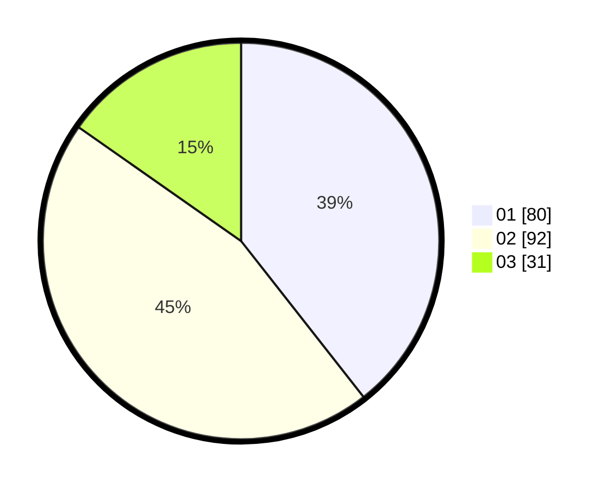

# Hasil

Hasil perolehan suara paslon dapat dilihat pada file paslon-01.txt, paslon-02.txt, dan paslon-03.txt.

Jika tidak ada, artinya data tersebut belum ada pada SIREKAP.

## Perolehan Suara

 * Paslon 01: **80**.
 * Paslon 02: **92**.
 * Paslon 03: **31**.

## Foto C Plano

https://sirekap-obj-formc.kpu.go.id/6115/pemilu/ppwp/31/73/07/10/02/3173071002042-20240214-212914--f6642997-97db-4874-adfd-bf01231061d1.jpg

https://sirekap-obj-formc.kpu.go.id/6115/pemilu/ppwp/31/73/07/10/02/3173071002042-20240214-212936--1c4d96f0-4edc-48a0-b26a-83fb9639a0f0.jpg

https://sirekap-obj-formc.kpu.go.id/6115/pemilu/ppwp/31/73/07/10/02/3173071002042-20240214-212925--362331c1-b752-4e8d-bbb3-b0c919f30bfc.jpg

## DATA PEMILIH TETAP

Jumlah pemilih dalam DPT: **264**.
 * L: **125**.
 * P: **139**.

## DATA PENGGUNA HAK PILIH

Jumlah pengguna hak pilih dalam DPT: **197**.
 * L: **95**.
 * P: **102**.

Jumlah pengguna hak pilih dalam DPTb: **6**.
 * L: **3**.
 * P: **3**.

Jumlah pengguna hak pilih dalam DPK: **2**.
 * L: **0**.
 * P: **2**.

Jumlah pengguna hak pilih: **205**.
 * L: **98**.
 * P: **107**.

## JUMLAH SUARA SAH DAN TIDAK SAH

JUMLAH SELURUH SUARA SAH: **203**.

JUMLAH SUARA TIDAK SAH: **2**.

JUMLAH SELURUH SUARA SAH DAN SUARA TIDAK SAH: **205**.
