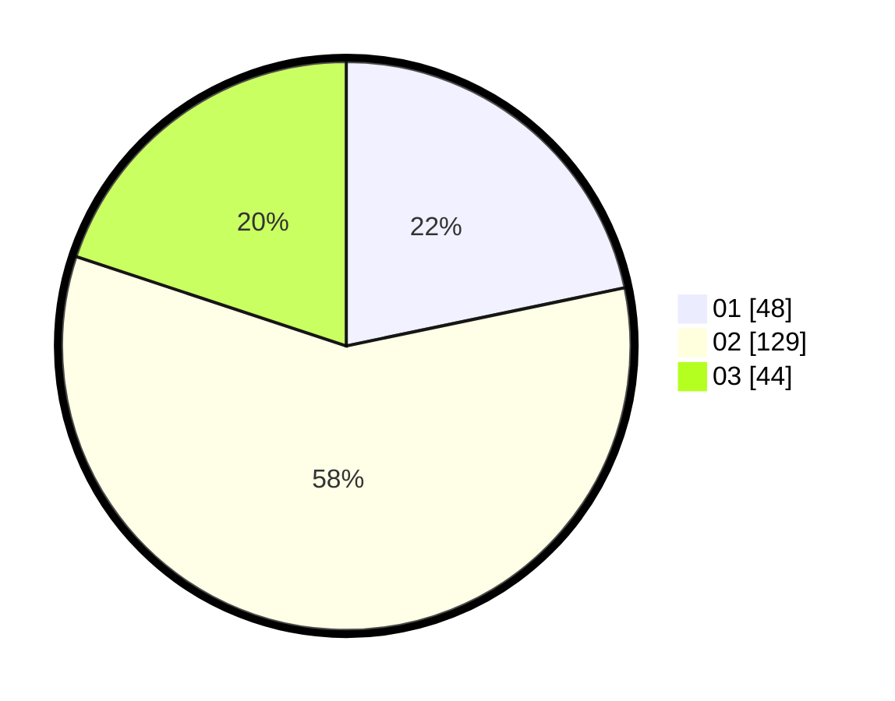

# Hasil

Hasil perolehan suara paslon dapat dilihat pada file paslon-01.txt, paslon-02.txt, dan paslon-03.txt.

Jika tidak ada, artinya data tersebut belum ada pada SIREKAP.

## Perolehan Suara

 * Paslon 01: **48**.
 * Paslon 02: **129**.
 * Paslon 03: **44**.

## Foto C Plano

https://sirekap-obj-formc.kpu.go.id/11bf/pemilu/ppwp/31/73/07/10/02/3173071002047-20240216-131655--4a986525-b00d-4e53-b77b-e8b06b576371.jpg

https://sirekap-obj-formc.kpu.go.id/11bf/pemilu/ppwp/31/73/07/10/02/3173071002047-20240216-131656--1c58e05e-55a9-4491-9dec-cb73aebb09bb.jpg

https://sirekap-obj-formc.kpu.go.id/11bf/pemilu/ppwp/31/73/07/10/02/3173071002047-20240216-131656--f4812fc6-5d0a-4d90-b2e6-7d672f78ba8c.jpg

## DATA PEMILIH TETAP

Jumlah pemilih dalam DPT: **260**.
 * L: **95**.
 * P: **165**.

## DATA PENGGUNA HAK PILIH

Jumlah pengguna hak pilih dalam DPT: **202**.
 * L: **68**.
 * P: **134**.

Jumlah pengguna hak pilih dalam DPTb: **7**.
 * L: **6**.
 * P: **1**.

Jumlah pengguna hak pilih dalam DPK: **13**.
 * L: **4**.
 * P: **9**.

Jumlah pengguna hak pilih: **222**.
 * L: **78**.
 * P: **144**.

## JUMLAH SUARA SAH DAN TIDAK SAH

JUMLAH SELURUH SUARA SAH: **221**.

JUMLAH SUARA TIDAK SAH: **1**.

JUMLAH SELURUH SUARA SAH DAN SUARA TIDAK SAH: **222**.
