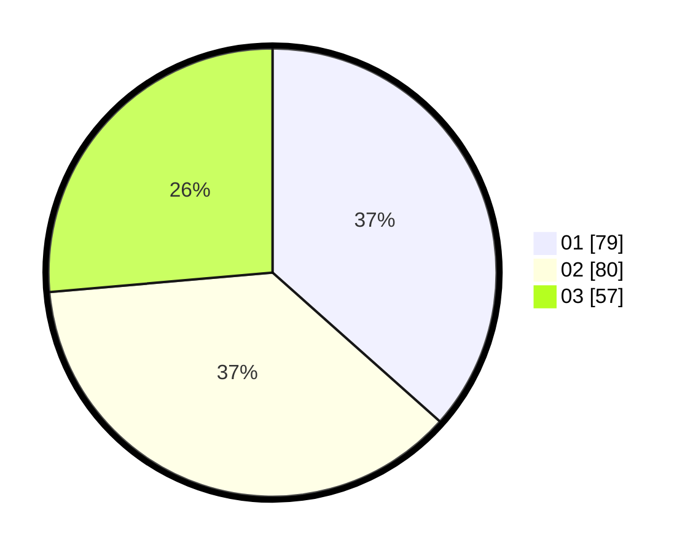

# Hasil

Hasil perolehan suara paslon dapat dilihat pada file paslon-01.txt, paslon-02.txt, dan paslon-03.txt.

Jika tidak ada, artinya data tersebut belum ada pada SIREKAP.

## Perolehan Suara

 * Paslon 01: **79**.
 * Paslon 02: **80**.
 * Paslon 03: **57**.

## Foto C Plano

https://sirekap-obj-formc.kpu.go.id/1460/pemilu/ppwp/31/73/07/10/02/3173071002053-20240216-151617--7ab29d72-963b-411d-803c-a2722f43028d.jpg

https://sirekap-obj-formc.kpu.go.id/1460/pemilu/ppwp/31/73/07/10/02/3173071002053-20240216-151619--274be86e-a407-4a33-8fb7-c8951d2fc433.jpg

https://sirekap-obj-formc.kpu.go.id/1460/pemilu/ppwp/31/73/07/10/02/3173071002053-20240216-151618--434daee1-f7ff-43b6-a4d1-22790daf2e84.jpg

## DATA PEMILIH TETAP

Jumlah pemilih dalam DPT: **278**.
 * L: **141**.
 * P: **137**.

## DATA PENGGUNA HAK PILIH

Jumlah pengguna hak pilih dalam DPT: **214**.
 * L: **103**.
 * P: **111**.

Jumlah pengguna hak pilih dalam DPTb: **7**.
 * L: **1**.
 * P: **6**.

Jumlah pengguna hak pilih dalam DPK: **0**.
 * L: **0**.
 * P: **0**.

Jumlah pengguna hak pilih: **221**.
 * L: **104**.
 * P: **117**.

## JUMLAH SUARA SAH DAN TIDAK SAH

JUMLAH SELURUH SUARA SAH: **216**.

JUMLAH SUARA TIDAK SAH: **5**.

JUMLAH SELURUH SUARA SAH DAN SUARA TIDAK SAH: **221**.
