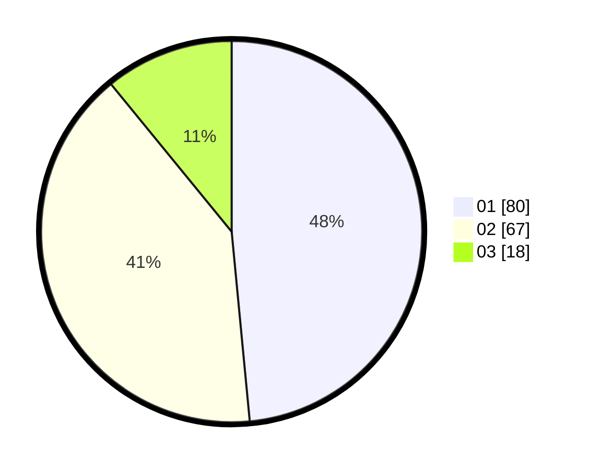

# Hasil

Hasil perolehan suara paslon dapat dilihat pada file paslon-01.txt, paslon-02.txt, dan paslon-03.txt.

Jika tidak ada, artinya data tersebut belum ada pada SIREKAP.

## Perolehan Suara

 * Paslon 01: **80**.
 * Paslon 02: **67**.
 * Paslon 03: **18**.

## Foto C Plano

https://sirekap-obj-formc.kpu.go.id/c1f8/pemilu/ppwp/31/73/07/10/02/3173071002056-20240216-144017--c166e1fa-ee26-498a-9c4b-698a3e9d83e8.jpg

https://sirekap-obj-formc.kpu.go.id/c1f8/pemilu/ppwp/31/73/07/10/02/3173071002056-20240216-144018--d40b6cc4-2861-4dbc-88ca-fd2ccc350b35.jpg

https://sirekap-obj-formc.kpu.go.id/c1f8/pemilu/ppwp/31/73/07/10/02/3173071002056-20240216-144017--7e2640b7-69bc-49ea-9530-efe111494b6a.jpg

## DATA PEMILIH TETAP

Jumlah pemilih dalam DPT: **196**.
 * L: **93**.
 * P: **103**.

## DATA PENGGUNA HAK PILIH

Jumlah pengguna hak pilih dalam DPT: **157**.
 * L: **70**.
 * P: **87**.

Jumlah pengguna hak pilih dalam DPTb: **8**.
 * L: **0**.
 * P: **8**.

Jumlah pengguna hak pilih dalam DPK: **1**.
 * L: **1**.
 * P: **0**.

Jumlah pengguna hak pilih: **166**.
 * L: **71**.
 * P: **95**.

## JUMLAH SUARA SAH DAN TIDAK SAH

JUMLAH SELURUH SUARA SAH: **165**.

JUMLAH SUARA TIDAK SAH: **1**.

JUMLAH SELURUH SUARA SAH DAN SUARA TIDAK SAH: **166**.
