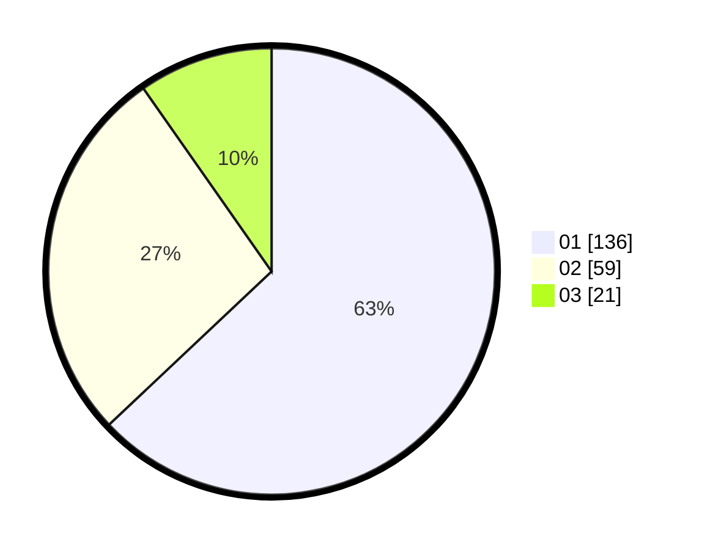

# Hasil

Hasil perolehan suara paslon dapat dilihat pada file paslon-01.txt, paslon-02.txt, dan paslon-03.txt.

Jika tidak ada, artinya data tersebut belum ada pada SIREKAP.

## Perolehan Suara

 * Paslon 01: **136**.
 * Paslon 02: **59**.
 * Paslon 03: **21**.

## Foto C Plano

https://sirekap-obj-formc.kpu.go.id/4cae/pemilu/ppwp/31/73/07/10/02/3173071002057-20240216-010045--7fec8125-38c6-4c20-84d0-c31d6b8b603e.jpg

https://sirekap-obj-formc.kpu.go.id/4cae/pemilu/ppwp/31/73/07/10/02/3173071002057-20240216-010053--310d6a25-6103-46f7-87a1-f6d7c3da4289.jpg

https://sirekap-obj-formc.kpu.go.id/4cae/pemilu/ppwp/31/73/07/10/02/3173071002057-20240216-010049--4a1d45d4-740b-48e9-bc6c-356b2119c8f3.jpg

## DATA PEMILIH TETAP

Jumlah pemilih dalam DPT: **272**.
 * L: **139**.
 * P: **133**.

## DATA PENGGUNA HAK PILIH

Jumlah pengguna hak pilih dalam DPT: **216**.
 * L: **104**.
 * P: **112**.

Jumlah pengguna hak pilih dalam DPTb: **5**.
 * L: **2**.
 * P: **3**.

Jumlah pengguna hak pilih dalam DPK: **0**.
 * L: **0**.
 * P: **0**.

Jumlah pengguna hak pilih: **221**.
 * L: **106**.
 * P: **115**.

## JUMLAH SUARA SAH DAN TIDAK SAH

JUMLAH SELURUH SUARA SAH: **216**.

JUMLAH SUARA TIDAK SAH: **5**.

JUMLAH SELURUH SUARA SAH DAN SUARA TIDAK SAH: **221**.
