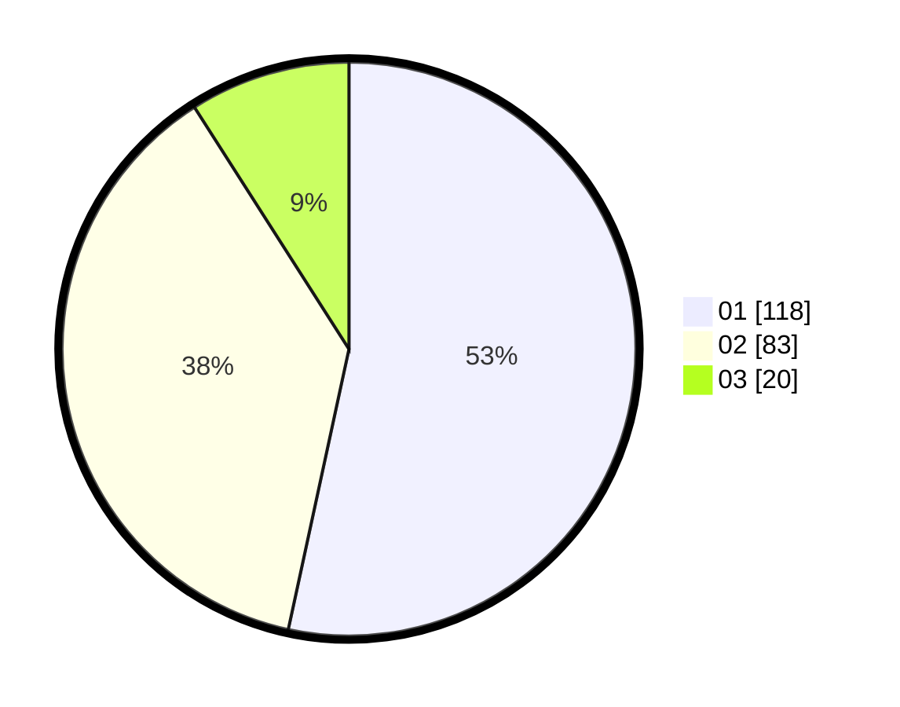

# Hasil

Hasil perolehan suara paslon dapat dilihat pada file paslon-01.txt, paslon-02.txt, dan paslon-03.txt.

Jika tidak ada, artinya data tersebut belum ada pada SIREKAP.

## Perolehan Suara

 * Paslon 01: **118**.
 * Paslon 02: **83**.
 * Paslon 03: **20**.

## Foto C Plano

https://sirekap-obj-formc.kpu.go.id/dc3e/pemilu/ppwp/31/73/07/10/02/3173071002058-20240214-185416--83b8e7f2-560d-48a9-8309-8220f66466c5.jpg

https://sirekap-obj-formc.kpu.go.id/dc3e/pemilu/ppwp/31/73/07/10/02/3173071002058-20240214-195513--a13b0a0f-c0ff-4739-bec1-d3d21025b543.jpg

https://sirekap-obj-formc.kpu.go.id/dc3e/pemilu/ppwp/31/73/07/10/02/3173071002058-20240214-185849--37d6a310-aac9-42be-b2ae-cd763faaf1fd.jpg

## DATA PEMILIH TETAP

Jumlah pemilih dalam DPT: **260**.
 * L: **134**.
 * P: **126**.

## DATA PENGGUNA HAK PILIH

Jumlah pengguna hak pilih dalam DPT: **213**.
 * L: **106**.
 * P: **107**.

Jumlah pengguna hak pilih dalam DPTb: **6**.
 * L: **2**.
 * P: **4**.

Jumlah pengguna hak pilih dalam DPK: **3**.
 * L: **2**.
 * P: **1**.

Jumlah pengguna hak pilih: **222**.
 * L: **110**.
 * P: **112**.

## JUMLAH SUARA SAH DAN TIDAK SAH

JUMLAH SELURUH SUARA SAH: **221**.

JUMLAH SUARA TIDAK SAH: **1**.

JUMLAH SELURUH SUARA SAH DAN SUARA TIDAK SAH: **222**.
