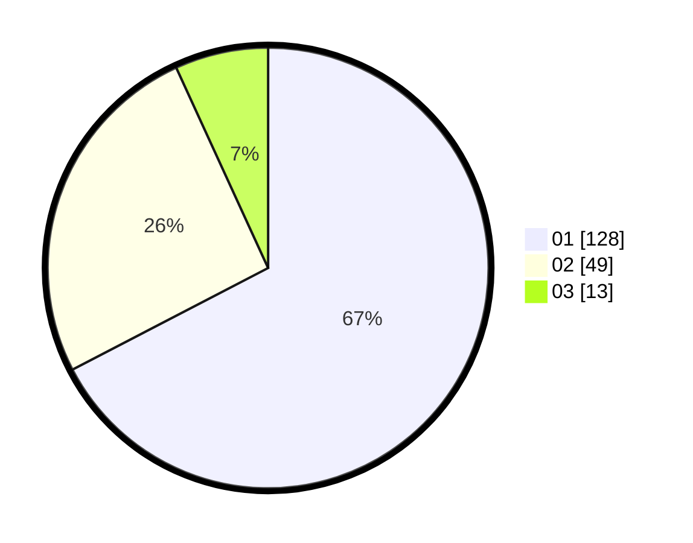

# Hasil

Hasil perolehan suara paslon dapat dilihat pada file paslon-01.txt, paslon-02.txt, dan paslon-03.txt.

Jika tidak ada, artinya data tersebut belum ada pada SIREKAP.

## Perolehan Suara

 * Paslon 01: **128**.
 * Paslon 02: **49**.
 * Paslon 03: **13**.

## Foto C Plano

https://sirekap-obj-formc.kpu.go.id/5aab/pemilu/ppwp/31/73/07/10/03/3173071003010-20240214-212352--6e7a104e-d1f2-41e1-8828-7616a44aedc0.jpg

https://sirekap-obj-formc.kpu.go.id/5aab/pemilu/ppwp/31/73/07/10/03/3173071003010-20240214-212556--2c2c6bfc-7c63-4467-ba00-abc18974efef.jpg

https://sirekap-obj-formc.kpu.go.id/5aab/pemilu/ppwp/31/73/07/10/03/3173071003010-20240214-212835--67288dc9-2576-4d35-93f2-e021b806dc27.jpg

## DATA PEMILIH TETAP

Jumlah pemilih dalam DPT: **267**.
 * L: **122**.
 * P: **145**.

## DATA PENGGUNA HAK PILIH

Jumlah pengguna hak pilih dalam DPT: **192**.
 * L: **84**.
 * P: **108**.

Jumlah pengguna hak pilih dalam DPTb: **0**.
 * L: **0**.
 * P: **0**.

Jumlah pengguna hak pilih dalam DPK: **0**.
 * L: **0**.
 * P: **0**.

Jumlah pengguna hak pilih: **192**.
 * L: **84**.
 * P: **108**.

## JUMLAH SUARA SAH DAN TIDAK SAH

JUMLAH SELURUH SUARA SAH: **190**.

JUMLAH SUARA TIDAK SAH: **2**.

JUMLAH SELURUH SUARA SAH DAN SUARA TIDAK SAH: **192**.
