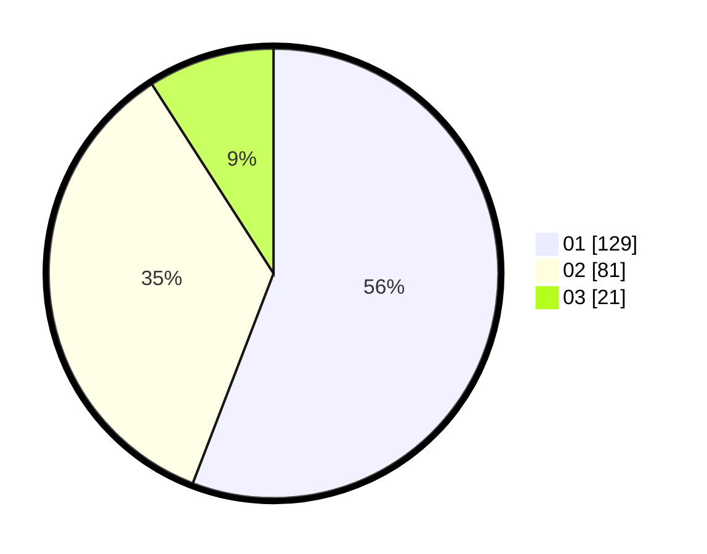

# Hasil

Hasil perolehan suara paslon dapat dilihat pada file paslon-01.txt, paslon-02.txt, dan paslon-03.txt.

Jika tidak ada, artinya data tersebut belum ada pada SIREKAP.

## Perolehan Suara

 * Paslon 01: **129**.
 * Paslon 02: **81**.
 * Paslon 03: **21**.

## Foto C Plano

https://sirekap-obj-formc.kpu.go.id/155e/pemilu/ppwp/31/73/07/10/03/3173071003012-20240214-234218--9ff5da3b-0428-4b34-804f-bba066f7a0fa.jpg

https://sirekap-obj-formc.kpu.go.id/155e/pemilu/ppwp/31/73/07/10/03/3173071003012-20240214-234437--999f391c-ecc8-40ba-91a4-68eefac0db56.jpg

https://sirekap-obj-formc.kpu.go.id/155e/pemilu/ppwp/31/73/07/10/03/3173071003012-20240214-234554--ad153699-91c3-42a2-a392-7ad393b0769c.jpg
