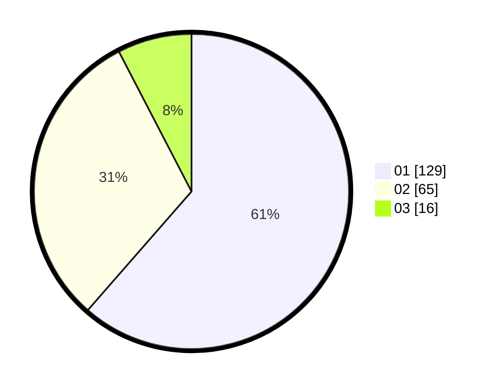

# Hasil

Hasil perolehan suara paslon dapat dilihat pada file paslon-01.txt, paslon-02.txt, dan paslon-03.txt.

Jika tidak ada, artinya data tersebut belum ada pada SIREKAP.

## Perolehan Suara

 * Paslon 01: **129**.
 * Paslon 02: **65**.
 * Paslon 03: **16**.

## Foto C Plano

https://sirekap-obj-formc.kpu.go.id/2e4f/pemilu/ppwp/31/73/07/10/03/3173071003013-20240214-235918--02708c10-95c3-40b1-aa30-5c0d0de887af.jpg

https://sirekap-obj-formc.kpu.go.id/2e4f/pemilu/ppwp/31/73/07/10/03/3173071003013-20240215-000126--d9936dca-2b7a-4eb3-9ad9-4a989f684ec8.jpg

https://sirekap-obj-formc.kpu.go.id/2e4f/pemilu/ppwp/31/73/07/10/03/3173071003013-20240215-000249--69929611-e775-46c8-a583-3238dac2cf0c.jpg
