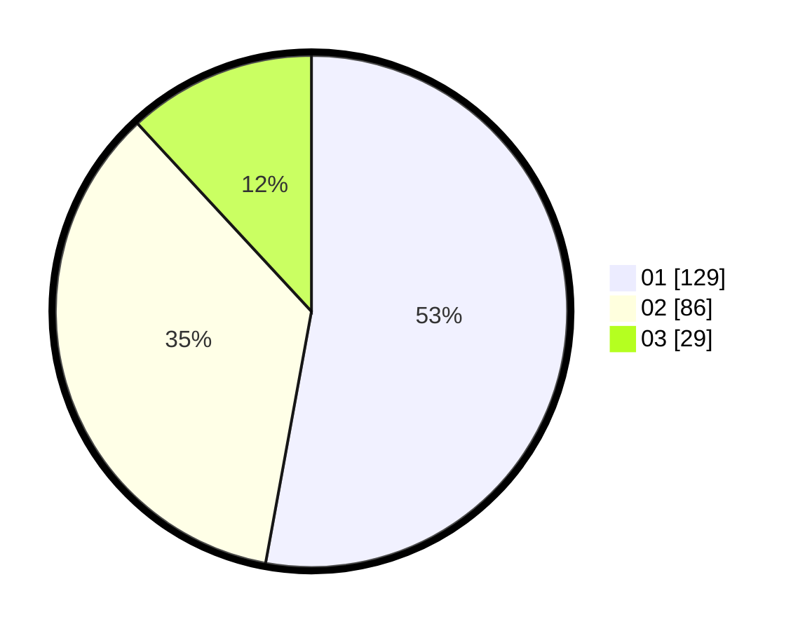

# Hasil

Hasil perolehan suara paslon dapat dilihat pada file paslon-01.txt, paslon-02.txt, dan paslon-03.txt.

Jika tidak ada, artinya data tersebut belum ada pada SIREKAP.

## Perolehan Suara

 * Paslon 01: **129**.
 * Paslon 02: **86**.
 * Paslon 03: **29**.

## Foto C Plano

https://sirekap-obj-formc.kpu.go.id/aab6/pemilu/ppwp/31/73/07/10/03/3173071003018-20240214-225716--d64aaee4-f304-4a3d-84d4-6ff4b645efaf.jpg

https://sirekap-obj-formc.kpu.go.id/aab6/pemilu/ppwp/31/73/07/10/03/3173071003018-20240214-225349--1503576e-c09a-4e2d-8216-1f29b11d002b.jpg

https://sirekap-obj-formc.kpu.go.id/aab6/pemilu/ppwp/31/73/07/10/03/3173071003018-20240214-230229--a1893872-568d-4846-a311-d5f3f172344a.jpg
