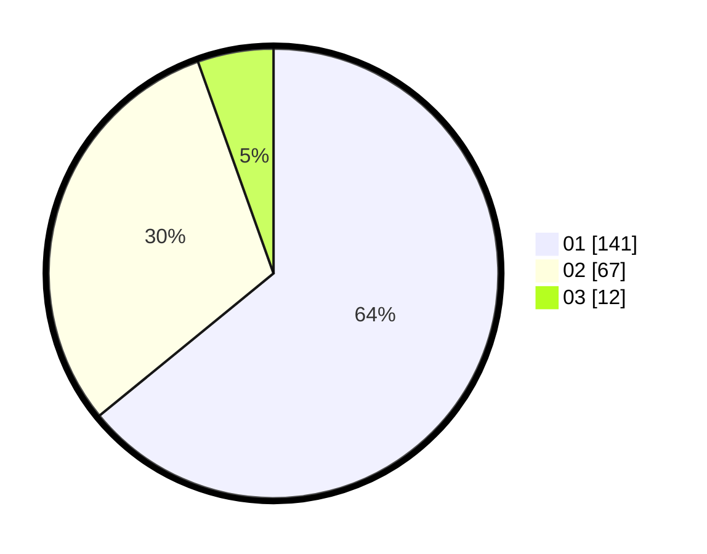

# Hasil

Hasil perolehan suara paslon dapat dilihat pada file paslon-01.txt, paslon-02.txt, dan paslon-03.txt.

Jika tidak ada, artinya data tersebut belum ada pada SIREKAP.

## Perolehan Suara

 * Paslon 01: **141**.
 * Paslon 02: **67**.
 * Paslon 03: **12**.

## Foto C Plano

https://sirekap-obj-formc.kpu.go.id/9a77/pemilu/ppwp/31/73/07/10/03/3173071003033-20240215-023651--28333f9b-d26d-4f67-bbc8-40ea4a482077.jpg

https://sirekap-obj-formc.kpu.go.id/9a77/pemilu/ppwp/31/73/07/10/03/3173071003033-20240215-023941--783e3ea7-a982-43f7-9fcf-c0a6f2445cc8.jpg

https://sirekap-obj-formc.kpu.go.id/9a77/pemilu/ppwp/31/73/07/10/03/3173071003033-20240215-052715--b928f541-e089-4f7b-94f9-f9c84612a0c7.jpg
