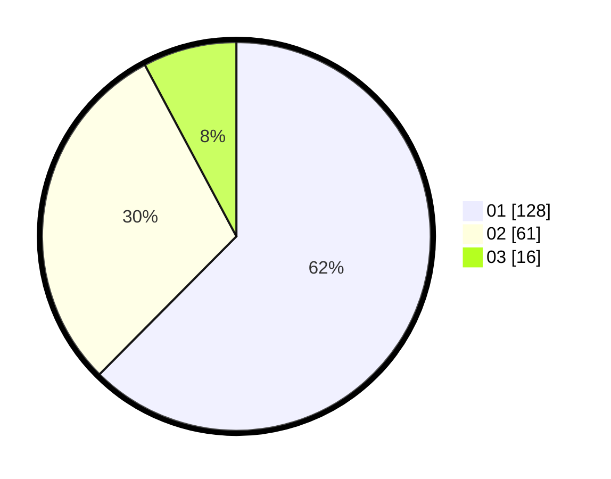

# Hasil

Hasil perolehan suara paslon dapat dilihat pada file paslon-01.txt, paslon-02.txt, dan paslon-03.txt.

Jika tidak ada, artinya data tersebut belum ada pada SIREKAP.

## Perolehan Suara

 * Paslon 01: **128**.
 * Paslon 02: **61**.
 * Paslon 03: **16**.

## Foto C Plano

https://sirekap-obj-formc.kpu.go.id/3668/pemilu/ppwp/31/73/07/10/03/3173071003035-20240214-232211--7c2a07fe-512b-416f-9b94-b22a5999e29a.jpg

https://sirekap-obj-formc.kpu.go.id/3668/pemilu/ppwp/31/73/07/10/03/3173071003035-20240214-223125--5576ec83-58e5-4e4e-9130-f23022a5fa8c.jpg

https://sirekap-obj-formc.kpu.go.id/3668/pemilu/ppwp/31/73/07/10/03/3173071003035-20240214-223405--01ff69bb-229f-4f11-af9a-c0fd47855da5.jpg

## DATA PEMILIH TETAP

Jumlah pemilih dalam DPT: **269**.
 * L: **135**.
 * P: **134**.

## DATA PENGGUNA HAK PILIH

Jumlah pengguna hak pilih dalam DPT: **204**.
 * L: **97**.
 * P: **107**.

Jumlah pengguna hak pilih dalam DPTb: **4**.
 * L: **1**.
 * P: **3**.

Jumlah pengguna hak pilih dalam DPK: **0**.
 * L: **0**.
 * P: **0**.

Jumlah pengguna hak pilih: **208**.
 * L: **98**.
 * P: **110**.

## JUMLAH SUARA SAH DAN TIDAK SAH

JUMLAH SELURUH SUARA SAH: **205**.

JUMLAH SUARA TIDAK SAH: **3**.

JUMLAH SELURUH SUARA SAH DAN SUARA TIDAK SAH: **208**.
