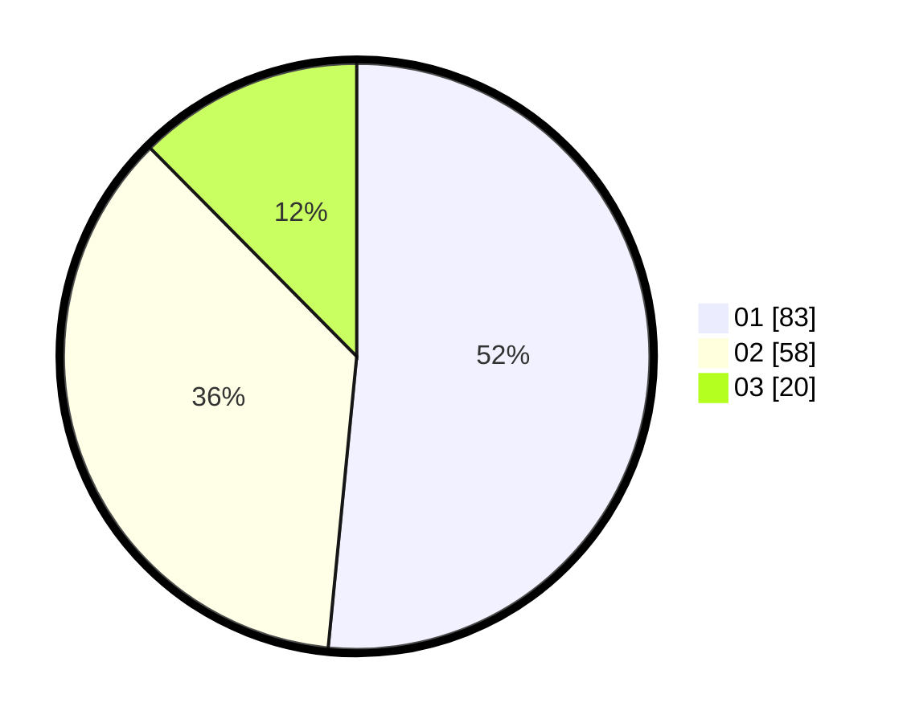

# Hasil

Hasil perolehan suara paslon dapat dilihat pada file paslon-01.txt, paslon-02.txt, dan paslon-03.txt.

Jika tidak ada, artinya data tersebut belum ada pada SIREKAP.

## Perolehan Suara

 * Paslon 01: **83**.
 * Paslon 02: **58**.
 * Paslon 03: **20**.

## Foto C Plano

https://sirekap-obj-formc.kpu.go.id/c1cf/pemilu/ppwp/31/73/07/10/03/3173071003041-20240214-213426--78bee723-e6b9-4867-a830-9b7c162287b7.jpg

https://sirekap-obj-formc.kpu.go.id/c1cf/pemilu/ppwp/31/73/07/10/03/3173071003041-20240214-213503--29dd4a4d-cc38-4795-979a-bd545481d40e.jpg

https://sirekap-obj-formc.kpu.go.id/c1cf/pemilu/ppwp/31/73/07/10/03/3173071003041-20240214-213604--b62a04a5-fd22-4115-b944-c70e746a484d.jpg
