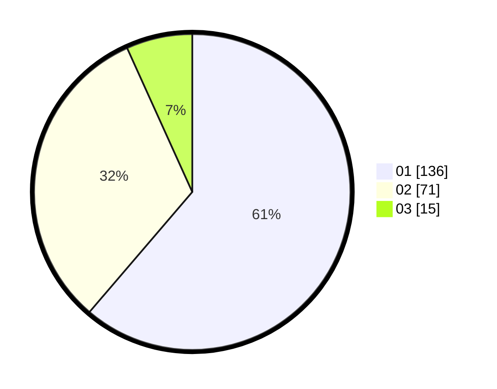

# Hasil

Hasil perolehan suara paslon dapat dilihat pada file paslon-01.txt, paslon-02.txt, dan paslon-03.txt.

Jika tidak ada, artinya data tersebut belum ada pada SIREKAP.

## Perolehan Suara

 * Paslon 01: **136**.
 * Paslon 02: **71**.
 * Paslon 03: **15**.

## Foto C Plano

https://sirekap-obj-formc.kpu.go.id/d283/pemilu/ppwp/31/73/07/10/03/3173071003043-20240214-192645--47beedee-3547-4861-a8ae-369eb5d8a3c6.jpg

https://sirekap-obj-formc.kpu.go.id/d283/pemilu/ppwp/31/73/07/10/03/3173071003043-20240214-234815--588a7ac3-6865-413e-a8cf-70da50c96214.jpg

https://sirekap-obj-formc.kpu.go.id/d283/pemilu/ppwp/31/73/07/10/03/3173071003043-20240214-234833--f530b68e-5e0d-442e-aeb0-ba8839f62816.jpg
