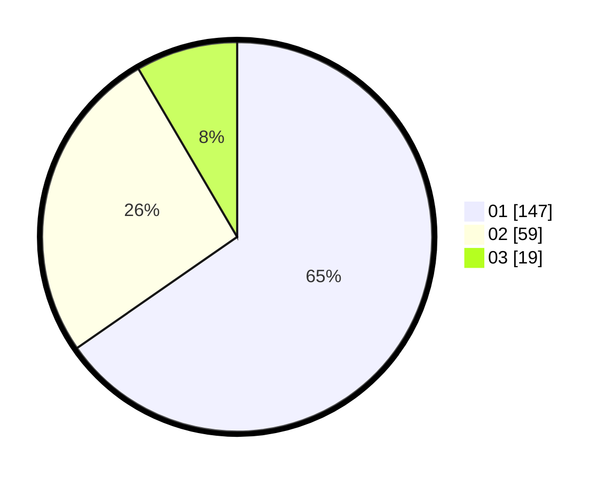

# Hasil

Hasil perolehan suara paslon dapat dilihat pada file paslon-01.txt, paslon-02.txt, dan paslon-03.txt.

Jika tidak ada, artinya data tersebut belum ada pada SIREKAP.

## Perolehan Suara

 * Paslon 01: **147**.
 * Paslon 02: **59**.
 * Paslon 03: **19**.

## Foto C Plano

https://sirekap-obj-formc.kpu.go.id/d540/pemilu/ppwp/31/73/07/10/03/3173071003045-20240214-195723--c4b7a334-d32f-45b5-b779-f8cf6d71aa81.jpg

https://sirekap-obj-formc.kpu.go.id/d540/pemilu/ppwp/31/73/07/10/03/3173071003045-20240214-195856--71dee692-77ab-4b1c-99b3-d747c41748b9.jpg

https://sirekap-obj-formc.kpu.go.id/d540/pemilu/ppwp/31/73/07/10/03/3173071003045-20240214-200030--5978390b-f1ec-4be1-a0ad-04cc5748e982.jpg
