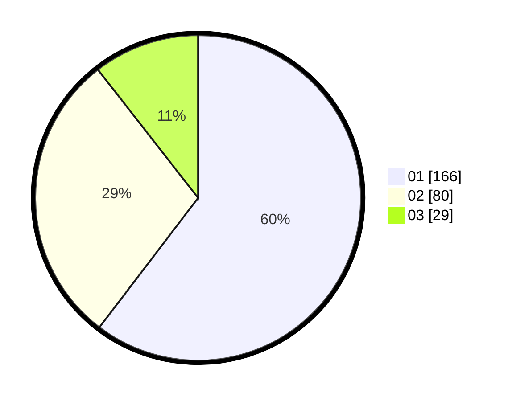

# Hasil

Hasil perolehan suara paslon dapat dilihat pada file paslon-01.txt, paslon-02.txt, dan paslon-03.txt.

Jika tidak ada, artinya data tersebut belum ada pada SIREKAP.

## Perolehan Suara

 * Paslon 01: **166**.
 * Paslon 02: **80**.
 * Paslon 03: **29**.

## Foto C Plano

https://sirekap-obj-formc.kpu.go.id/72c0/pemilu/ppwp/31/73/07/10/03/3173071003050-20240214-234446--4692588a-67a6-45e1-8b68-14889190eb0c.jpg

https://sirekap-obj-formc.kpu.go.id/72c0/pemilu/ppwp/31/73/07/10/03/3173071003050-20240214-234558--61fca774-9574-480f-8988-c42b86294271.jpg

https://sirekap-obj-formc.kpu.go.id/72c0/pemilu/ppwp/31/73/07/10/03/3173071003050-20240214-234628--4351fcb8-f48b-4485-ac99-792d7b696ddb.jpg
