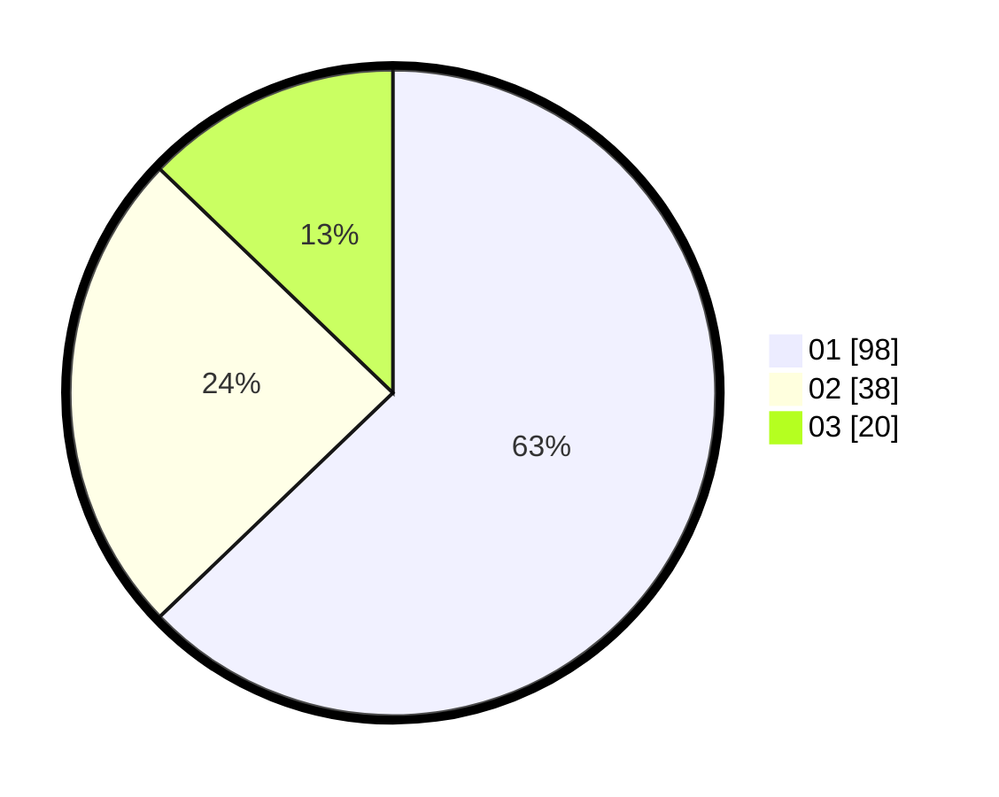

# Hasil

Hasil perolehan suara paslon dapat dilihat pada file paslon-01.txt, paslon-02.txt, dan paslon-03.txt.

Jika tidak ada, artinya data tersebut belum ada pada SIREKAP.

## Perolehan Suara

 * Paslon 01: **98**.
 * Paslon 02: **38**.
 * Paslon 03: **20**.

## Foto C Plano

https://sirekap-obj-formc.kpu.go.id/c55e/pemilu/ppwp/31/73/07/10/03/3173071003057-20240214-192934--6723d1d3-f6f3-41ad-8414-244d401556f1.jpg

https://sirekap-obj-formc.kpu.go.id/c55e/pemilu/ppwp/31/73/07/10/03/3173071003057-20240214-193213--839ece99-9019-4842-b076-ef3aec74d411.jpg

https://sirekap-obj-formc.kpu.go.id/c55e/pemilu/ppwp/31/73/07/10/03/3173071003057-20240214-193725--73aaab9f-eb87-4e5b-8540-41fe2df80b86.jpg

## DATA PEMILIH TETAP

Jumlah pemilih dalam DPT: **222**.
 * L: **112**.
 * P: **110**.

## DATA PENGGUNA HAK PILIH

Jumlah pengguna hak pilih dalam DPT: **159**.
 * L: **77**.
 * P: **82**.

Jumlah pengguna hak pilih dalam DPTb: **0**.
 * L: **0**.
 * P: **0**.

Jumlah pengguna hak pilih dalam DPK: **0**.
 * L: **0**.
 * P: **0**.

Jumlah pengguna hak pilih: **159**.
 * L: **77**.
 * P: **82**.

## JUMLAH SUARA SAH DAN TIDAK SAH

JUMLAH SELURUH SUARA SAH: **156**.

JUMLAH SUARA TIDAK SAH: **3**.

JUMLAH SELURUH SUARA SAH DAN SUARA TIDAK SAH: **159**.
