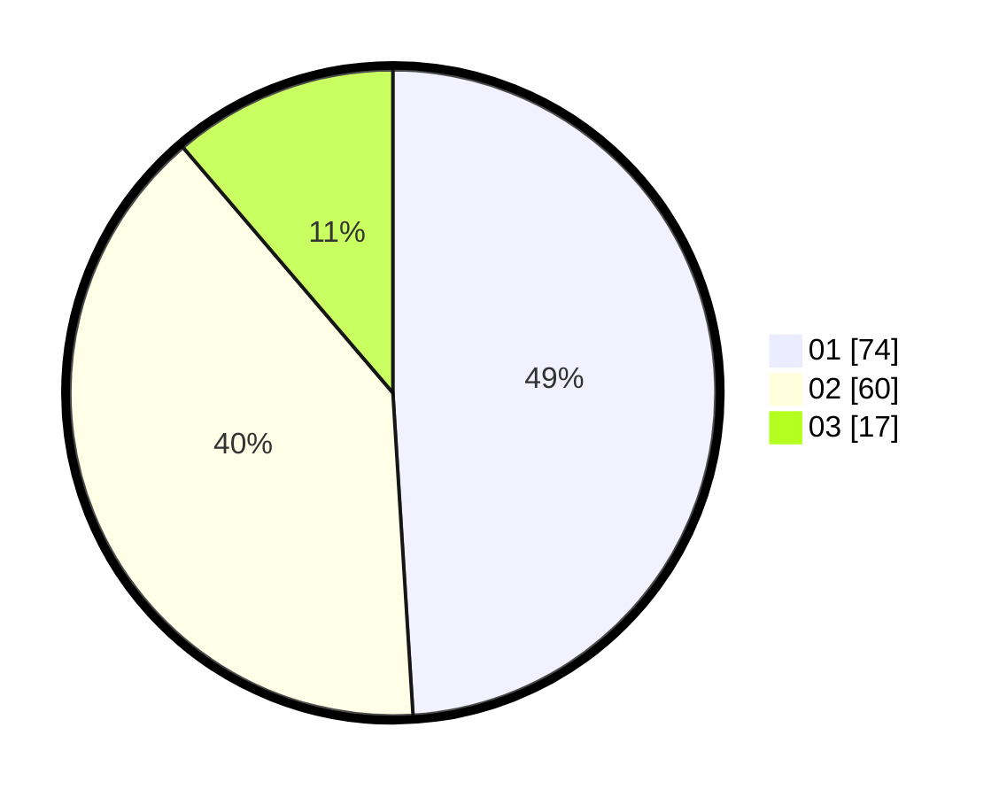

# Hasil

Hasil perolehan suara paslon dapat dilihat pada file paslon-01.txt, paslon-02.txt, dan paslon-03.txt.

Jika tidak ada, artinya data tersebut belum ada pada SIREKAP.

## Perolehan Suara

 * Paslon 01: **74**.
 * Paslon 02: **60**.
 * Paslon 03: **17**.

## Foto C Plano

https://sirekap-obj-formc.kpu.go.id/c6f3/pemilu/ppwp/31/73/07/10/03/3173071003058-20240215-015804--d42db9e8-6a02-4cc5-83bc-2e426ae7aed8.jpg

https://sirekap-obj-formc.kpu.go.id/c6f3/pemilu/ppwp/31/73/07/10/03/3173071003058-20240215-015700--dba9a2f4-15f4-4a70-a757-00401e247f2a.jpg

https://sirekap-obj-formc.kpu.go.id/c6f3/pemilu/ppwp/31/73/07/10/03/3173071003058-20240215-015240--2da3a75b-2e85-4f8f-9a26-2deebe5c51d6.jpg
