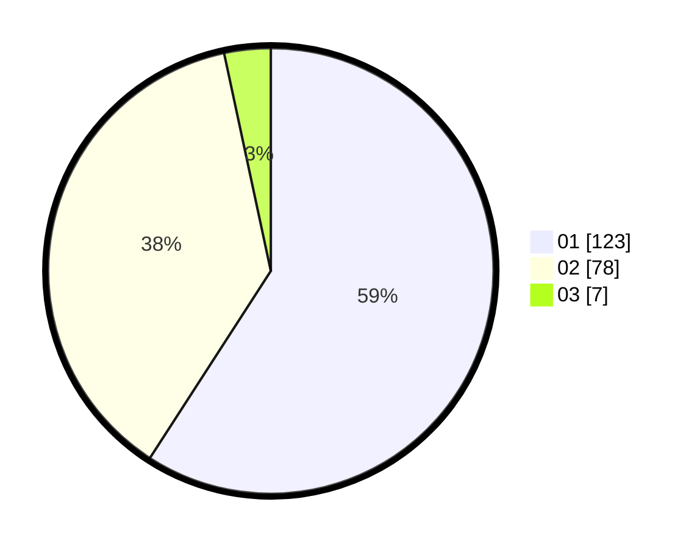

# Hasil

Hasil perolehan suara paslon dapat dilihat pada file paslon-01.txt, paslon-02.txt, dan paslon-03.txt.

Jika tidak ada, artinya data tersebut belum ada pada SIREKAP.

## Perolehan Suara

 * Paslon 01: **123**.
 * Paslon 02: **78**.
 * Paslon 03: **7**.

## Foto C Plano

https://sirekap-obj-formc.kpu.go.id/d8ac/pemilu/ppwp/31/73/07/10/03/3173071003061-20240214-230414--55035660-2721-4aba-a18e-f5bc71cf7928.jpg

https://sirekap-obj-formc.kpu.go.id/d8ac/pemilu/ppwp/31/73/07/10/03/3173071003061-20240214-230532--4d90657d-6b6d-4e35-9c61-eb454cbb3c22.jpg

https://sirekap-obj-formc.kpu.go.id/d8ac/pemilu/ppwp/31/73/07/10/03/3173071003061-20240214-230646--eca793ce-7b89-4e42-a581-06b42b0effaa.jpg
