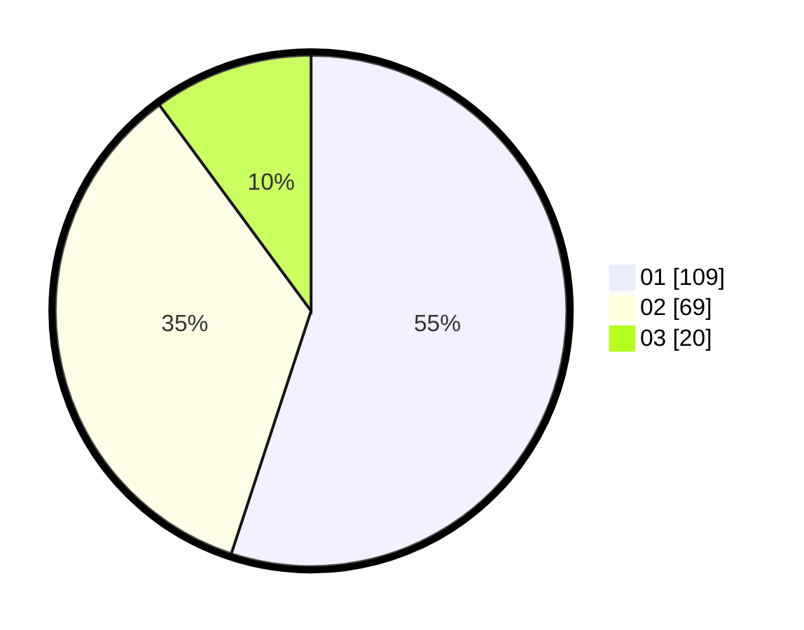

# Hasil

Hasil perolehan suara paslon dapat dilihat pada file paslon-01.txt, paslon-02.txt, dan paslon-03.txt.

Jika tidak ada, artinya data tersebut belum ada pada SIREKAP.

## Perolehan Suara

 * Paslon 01: **109**.
 * Paslon 02: **69**.
 * Paslon 03: **20**.

## Foto C Plano

https://sirekap-obj-formc.kpu.go.id/f853/pemilu/ppwp/31/73/07/10/03/3173071003062-20240214-160115--181dfe95-2c01-401e-bfb1-4054a7b039a2.jpg

https://sirekap-obj-formc.kpu.go.id/f853/pemilu/ppwp/31/73/07/10/03/3173071003062-20240214-192903--8bb0991c-64de-484f-a700-5e880df148d5.jpg

https://sirekap-obj-formc.kpu.go.id/f853/pemilu/ppwp/31/73/07/10/03/3173071003062-20240214-203523--7e29dc28-5ad3-4044-84c7-912badb436c7.jpg

## DATA PEMILIH TETAP

Jumlah pemilih dalam DPT: **274**.
 * L: **124**.
 * P: **150**.

## DATA PENGGUNA HAK PILIH

Jumlah pengguna hak pilih dalam DPT: **204**.
 * L: **91**.
 * P: **113**.

Jumlah pengguna hak pilih dalam DPTb: **0**.
 * L: **0**.
 * P: **0**.

Jumlah pengguna hak pilih dalam DPK: **0**.
 * L: **0**.
 * P: **0**.

Jumlah pengguna hak pilih: **204**.
 * L: **91**.
 * P: **113**.

## JUMLAH SUARA SAH DAN TIDAK SAH

JUMLAH SELURUH SUARA SAH: **198**.

JUMLAH SUARA TIDAK SAH: **6**.

JUMLAH SELURUH SUARA SAH DAN SUARA TIDAK SAH: **204**.
