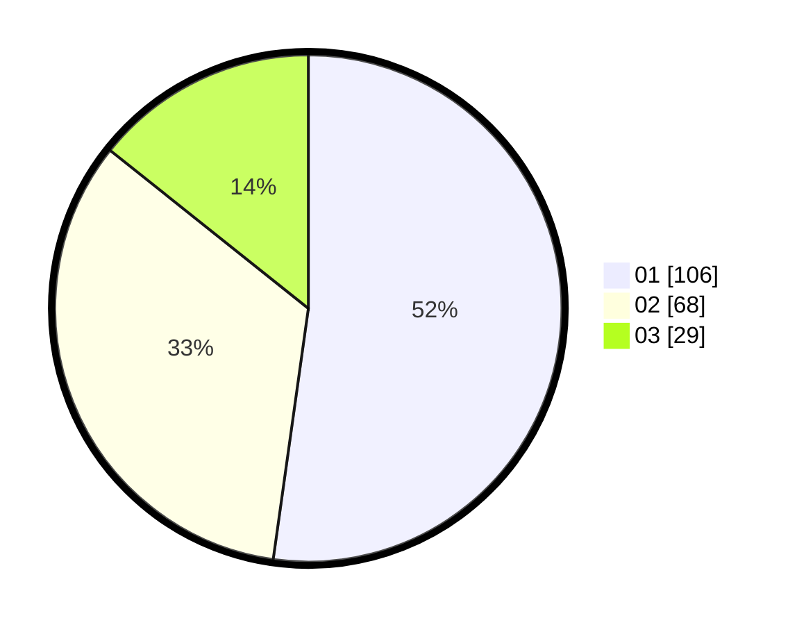

# Hasil

Hasil perolehan suara paslon dapat dilihat pada file paslon-01.txt, paslon-02.txt, dan paslon-03.txt.

Jika tidak ada, artinya data tersebut belum ada pada SIREKAP.

## Perolehan Suara

 * Paslon 01: **106**.
 * Paslon 02: **68**.
 * Paslon 03: **29**.

## Foto C Plano

https://sirekap-obj-formc.kpu.go.id/0c89/pemilu/ppwp/31/73/07/10/03/3173071003064-20240215-000730--28d156b3-23e4-4433-adb8-1882fedc500e.jpg

https://sirekap-obj-formc.kpu.go.id/0c89/pemilu/ppwp/31/73/07/10/03/3173071003064-20240215-000903--c2fbf16b-4b6a-4fef-8577-1919f6ba3168.jpg

https://sirekap-obj-formc.kpu.go.id/0c89/pemilu/ppwp/31/73/07/10/03/3173071003064-20240215-022726--2520688b-1c9b-4f7c-a21c-b4a91599a1a4.jpg
