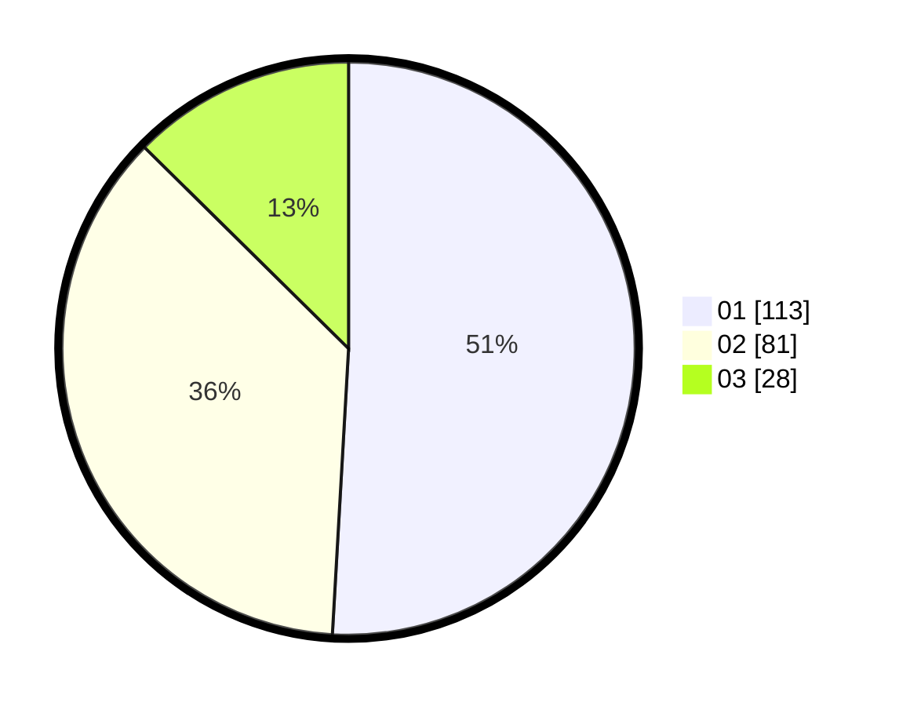

# Hasil

Hasil perolehan suara paslon dapat dilihat pada file paslon-01.txt, paslon-02.txt, dan paslon-03.txt.

Jika tidak ada, artinya data tersebut belum ada pada SIREKAP.

## Perolehan Suara

 * Paslon 01: **113**.
 * Paslon 02: **81**.
 * Paslon 03: **28**.

## Foto C Plano

https://sirekap-obj-formc.kpu.go.id/ca95/pemilu/ppwp/31/73/07/10/03/3173071003065-20240215-004449--52c4178e-a91f-4a07-96d3-3fce40a3b5df.jpg

https://sirekap-obj-formc.kpu.go.id/ca95/pemilu/ppwp/31/73/07/10/03/3173071003065-20240215-004909--c1bc3318-d95d-4028-b108-fe988225db2a.jpg

https://sirekap-obj-formc.kpu.go.id/ca95/pemilu/ppwp/31/73/07/10/03/3173071003065-20240215-005059--b470edfd-29f1-40c6-ba7a-bf16c9069a04.jpg
