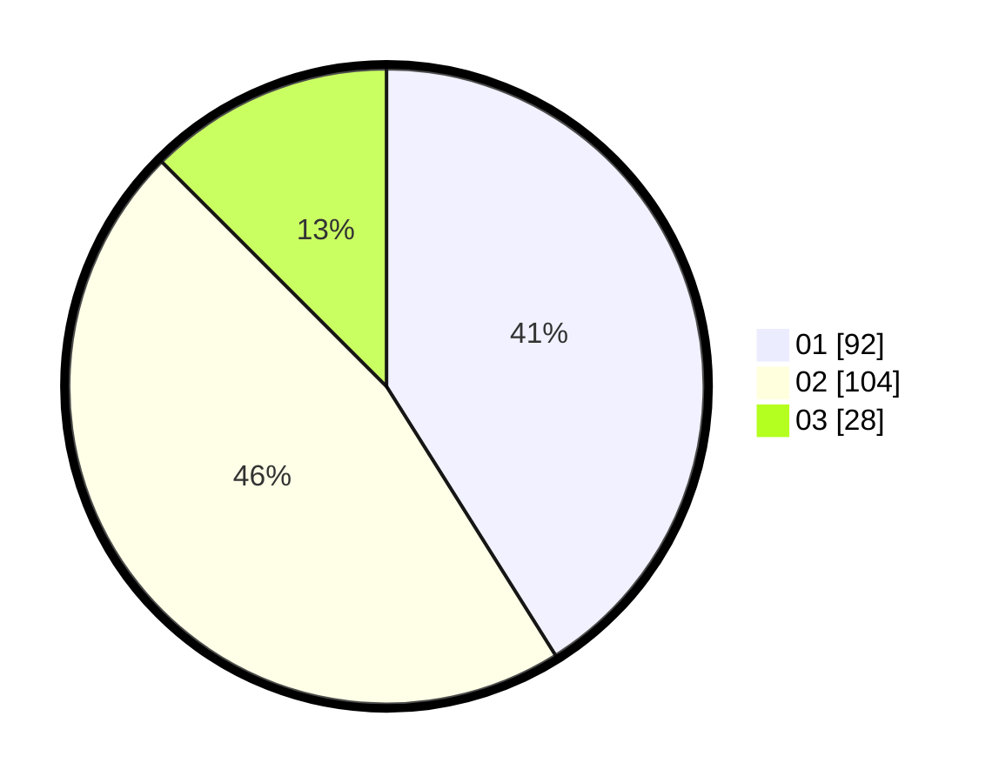

# Hasil

Hasil perolehan suara paslon dapat dilihat pada file paslon-01.txt, paslon-02.txt, dan paslon-03.txt.

Jika tidak ada, artinya data tersebut belum ada pada SIREKAP.

## Perolehan Suara

 * Paslon 01: **92**.
 * Paslon 02: **104**.
 * Paslon 03: **28**.

## Foto C Plano

https://sirekap-obj-formc.kpu.go.id/685a/pemilu/ppwp/31/73/07/10/03/3173071003071-20240214-224845--63131929-a3eb-4c9b-bdf4-d19cde917e21.jpg

https://sirekap-obj-formc.kpu.go.id/685a/pemilu/ppwp/31/73/07/10/03/3173071003071-20240214-231200--a191717b-1244-4d44-a37e-9cd204e43f23.jpg

https://sirekap-obj-formc.kpu.go.id/685a/pemilu/ppwp/31/73/07/10/03/3173071003071-20240214-231349--86829a5b-0296-43cd-b8bf-5e7b76773294.jpg
