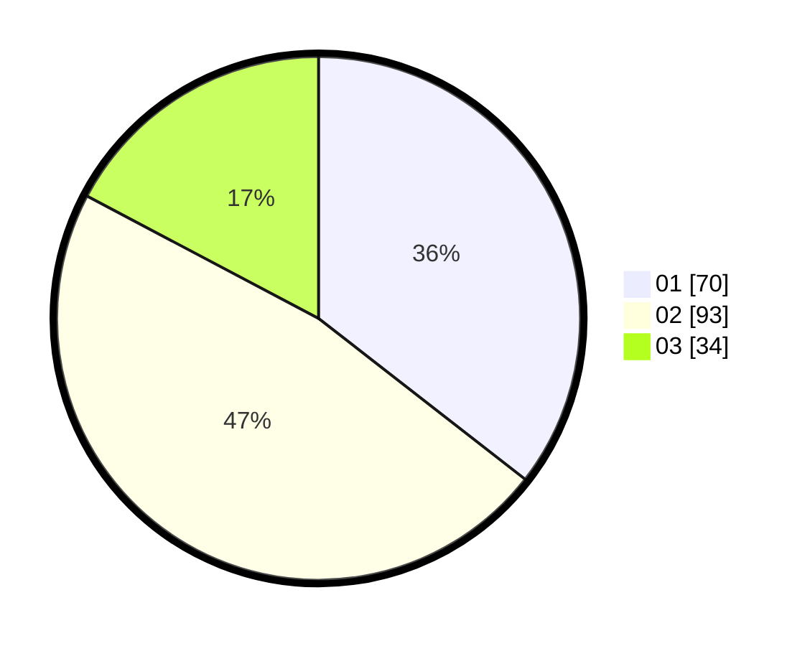

# Hasil

Hasil perolehan suara paslon dapat dilihat pada file paslon-01.txt, paslon-02.txt, dan paslon-03.txt.

Jika tidak ada, artinya data tersebut belum ada pada SIREKAP.

## Perolehan Suara

 * Paslon 01: **70**.
 * Paslon 02: **93**.
 * Paslon 03: **34**.

## Foto C Plano

https://sirekap-obj-formc.kpu.go.id/7ea5/pemilu/ppwp/31/73/07/10/03/3173071003072-20240214-155051--0c26e574-8265-4203-b745-c31dda68abb5.jpg

https://sirekap-obj-formc.kpu.go.id/7ea5/pemilu/ppwp/31/73/07/10/03/3173071003072-20240214-155623--353cc72f-c14c-48f6-840c-1285146e278b.jpg

https://sirekap-obj-formc.kpu.go.id/7ea5/pemilu/ppwp/31/73/07/10/03/3173071003072-20240214-155104--448c76b9-d0ba-46ad-aa83-885d08c65ade.jpg

## DATA PEMILIH TETAP

Jumlah pemilih dalam DPT: **258**.
 * L: **127**.
 * P: **131**.

## DATA PENGGUNA HAK PILIH

Jumlah pengguna hak pilih dalam DPT: **201**.
 * L: **93**.
 * P: **108**.

Jumlah pengguna hak pilih dalam DPTb: **0**.
 * L: **0**.
 * P: **0**.

Jumlah pengguna hak pilih dalam DPK: **1**.
 * L: **0**.
 * P: **1**.

Jumlah pengguna hak pilih: **202**.
 * L: **93**.
 * P: **109**.

## JUMLAH SUARA SAH DAN TIDAK SAH

JUMLAH SELURUH SUARA SAH: **197**.

JUMLAH SUARA TIDAK SAH: **5**.

JUMLAH SELURUH SUARA SAH DAN SUARA TIDAK SAH: **202**.
