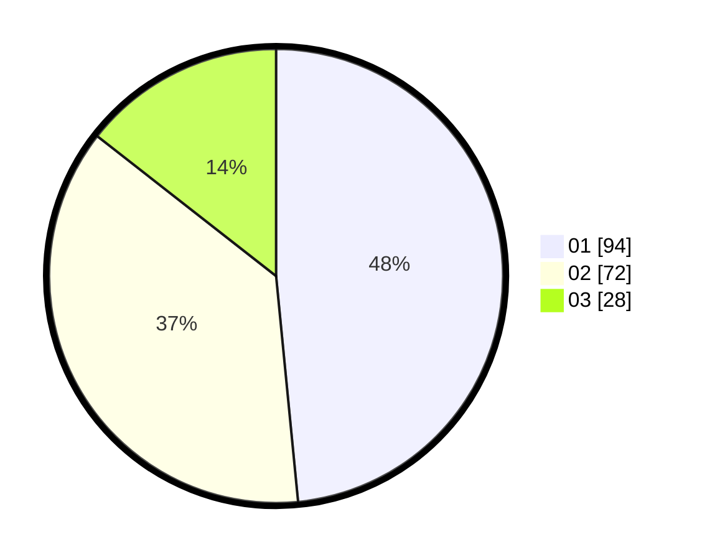

# Hasil

Hasil perolehan suara paslon dapat dilihat pada file paslon-01.txt, paslon-02.txt, dan paslon-03.txt.

Jika tidak ada, artinya data tersebut belum ada pada SIREKAP.

## Perolehan Suara

 * Paslon 01: **94**.
 * Paslon 02: **72**.
 * Paslon 03: **28**.

## Foto C Plano

https://sirekap-obj-formc.kpu.go.id/39ca/pemilu/ppwp/31/73/07/10/03/3173071003075-20240214-230002--c5479af6-7ea5-4818-bdb4-3bfffba4a6b8.jpg

https://sirekap-obj-formc.kpu.go.id/39ca/pemilu/ppwp/31/73/07/10/03/3173071003075-20240214-231940--d5d1dd59-b976-467a-b3e6-07008ca4daa4.jpg

https://sirekap-obj-formc.kpu.go.id/39ca/pemilu/ppwp/31/73/07/10/03/3173071003075-20240215-024320--fa17f514-a553-4d93-b0f2-a437f9715dc8.jpg
