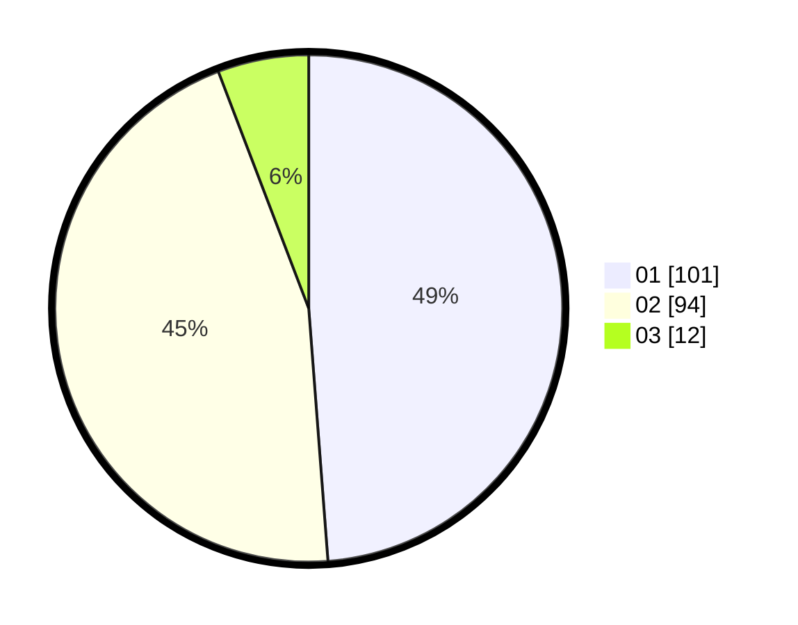

# Hasil

Hasil perolehan suara paslon dapat dilihat pada file paslon-01.txt, paslon-02.txt, dan paslon-03.txt.

Jika tidak ada, artinya data tersebut belum ada pada SIREKAP.

## Perolehan Suara

 * Paslon 01: **101**.
 * Paslon 02: **94**.
 * Paslon 03: **12**.

## Foto C Plano

https://sirekap-obj-formc.kpu.go.id/9cee/pemilu/ppwp/31/73/07/10/03/3173071003082-20240214-185824--a94d264f-bd82-4fd2-a853-5156f7400e9a.jpg

https://sirekap-obj-formc.kpu.go.id/9cee/pemilu/ppwp/31/73/07/10/03/3173071003082-20240214-190317--19a75649-da57-4ba3-a0e4-8890c4f34252.jpg

https://sirekap-obj-formc.kpu.go.id/9cee/pemilu/ppwp/31/73/07/10/03/3173071003082-20240214-191214--60d251d7-8aa0-4538-93f9-59c429c3be62.jpg

## DATA PEMILIH TETAP

Jumlah pemilih dalam DPT: **238**.
 * L: **119**.
 * P: **119**.

## DATA PENGGUNA HAK PILIH

Jumlah pengguna hak pilih dalam DPT: **198**.
 * L: **102**.
 * P: **96**.

Jumlah pengguna hak pilih dalam DPTb: **12**.
 * L: **6**.
 * P: **6**.

Jumlah pengguna hak pilih dalam DPK: **0**.
 * L: **0**.
 * P: **0**.

Jumlah pengguna hak pilih: **210**.
 * L: **108**.
 * P: **102**.

## JUMLAH SUARA SAH DAN TIDAK SAH

JUMLAH SELURUH SUARA SAH: **207**.

JUMLAH SUARA TIDAK SAH: **3**.

JUMLAH SELURUH SUARA SAH DAN SUARA TIDAK SAH: **210**.
