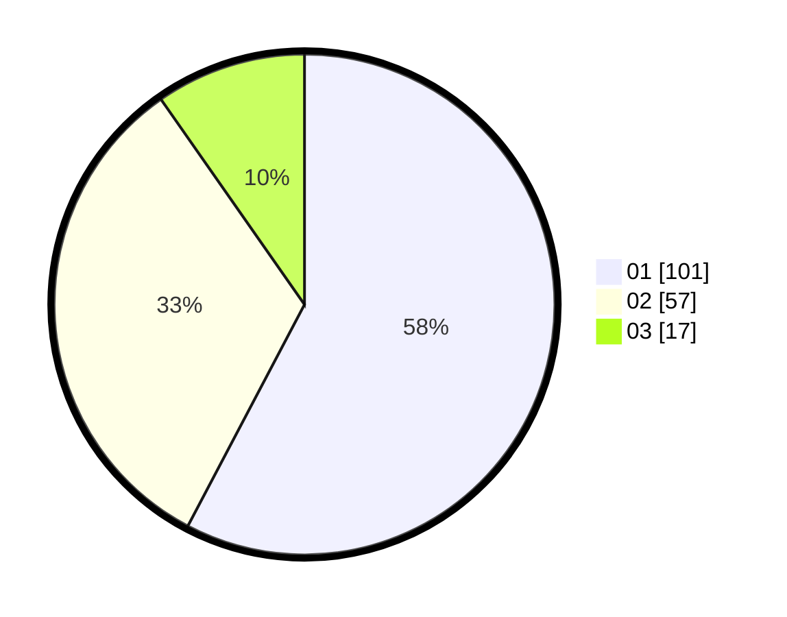

# Hasil

Hasil perolehan suara paslon dapat dilihat pada file paslon-01.txt, paslon-02.txt, dan paslon-03.txt.

Jika tidak ada, artinya data tersebut belum ada pada SIREKAP.

## Perolehan Suara

 * Paslon 01: **101**.
 * Paslon 02: **57**.
 * Paslon 03: **17**.

## Foto C Plano

https://sirekap-obj-formc.kpu.go.id/6e97/pemilu/ppwp/31/73/07/10/03/3173071003085-20240215-001915--2f2a6379-8aab-4abd-a7a2-93975fa47a1b.jpg

https://sirekap-obj-formc.kpu.go.id/6e97/pemilu/ppwp/31/73/07/10/03/3173071003085-20240215-002001--edb19396-d50b-4097-acd0-95288b2fc4ff.jpg

https://sirekap-obj-formc.kpu.go.id/6e97/pemilu/ppwp/31/73/07/10/03/3173071003085-20240215-002044--ef91ce9e-ad77-41de-8c38-826790141d38.jpg
