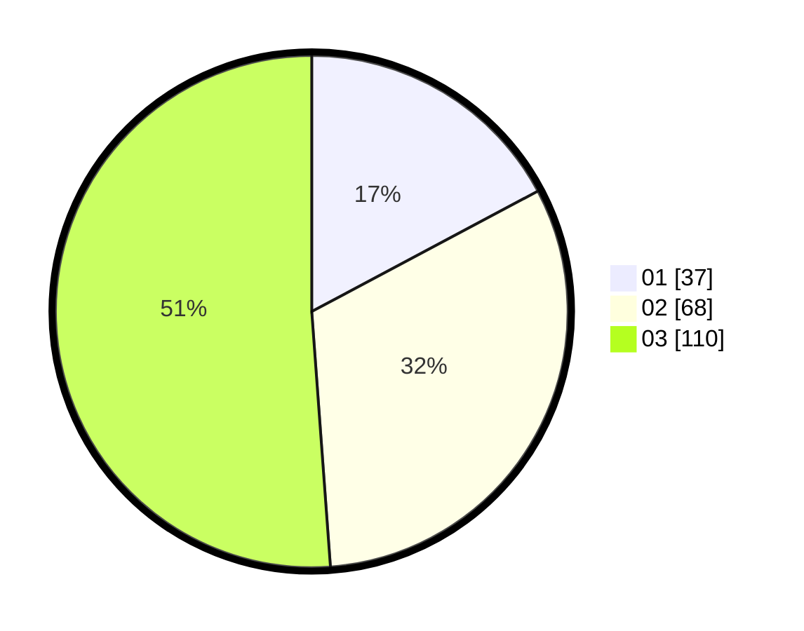

# Hasil

Hasil perolehan suara paslon dapat dilihat pada file paslon-01.txt, paslon-02.txt, dan paslon-03.txt.

Jika tidak ada, artinya data tersebut belum ada pada SIREKAP.

## Perolehan Suara

 * Paslon 01: **37**.
 * Paslon 02: **68**.
 * Paslon 03: **110**.

## Foto C Plano

https://sirekap-obj-formc.kpu.go.id/2f27/pemilu/ppwp/31/73/07/10/04/3173071004003-20240214-215715--cd22ef1e-d95c-438d-a727-370f2b8f6b75.jpg

https://sirekap-obj-formc.kpu.go.id/2f27/pemilu/ppwp/31/73/07/10/04/3173071004003-20240214-215801--3294c440-0693-4a7c-802b-c82862717e7d.jpg

https://sirekap-obj-formc.kpu.go.id/2f27/pemilu/ppwp/31/73/07/10/04/3173071004003-20240214-215911--9c78561f-1c12-476f-9c56-81c7089394c5.jpg
