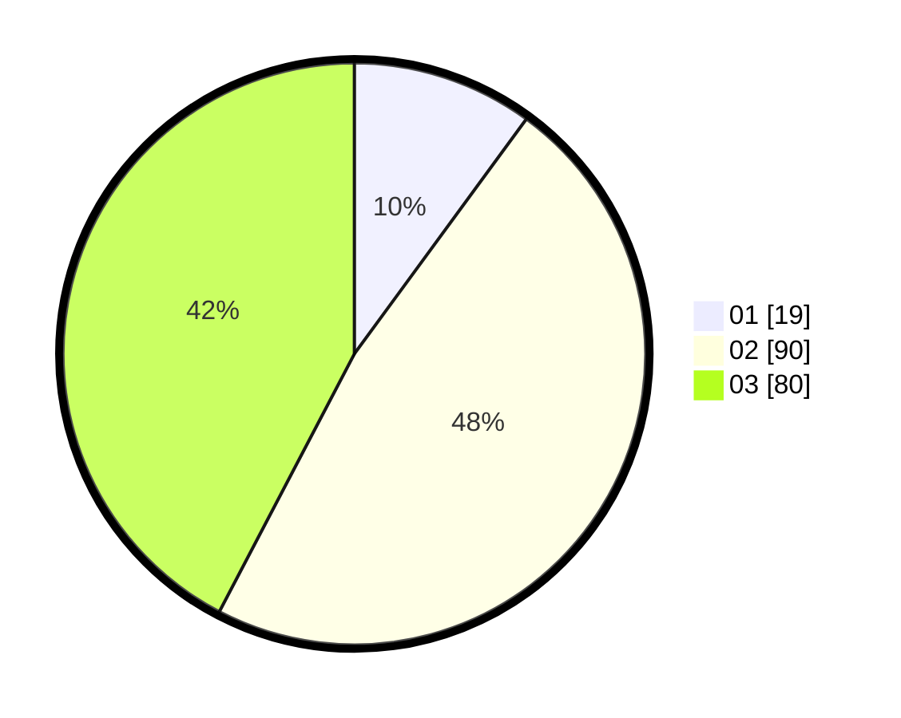

# Hasil

Hasil perolehan suara paslon dapat dilihat pada file paslon-01.txt, paslon-02.txt, dan paslon-03.txt.

Jika tidak ada, artinya data tersebut belum ada pada SIREKAP.

## Perolehan Suara

 * Paslon 01: **19**.
 * Paslon 02: **90**.
 * Paslon 03: **80**.

## Foto C Plano

https://sirekap-obj-formc.kpu.go.id/ca85/pemilu/ppwp/31/73/07/10/04/3173071004005-20240214-200021--d213d046-d1db-4cfa-88d1-08a4281bccab.jpg

https://sirekap-obj-formc.kpu.go.id/ca85/pemilu/ppwp/31/73/07/10/04/3173071004005-20240214-200031--9feca39f-cbcd-4565-b230-392b1e2fb47b.jpg

https://sirekap-obj-formc.kpu.go.id/ca85/pemilu/ppwp/31/73/07/10/04/3173071004005-20240214-200035--2d4b68a6-058f-40e4-afbf-a50732014486.jpg

## DATA PEMILIH TETAP

Jumlah pemilih dalam DPT: **182**.
 * L: **90**.
 * P: **92**.

## DATA PENGGUNA HAK PILIH

Jumlah pengguna hak pilih dalam DPT: **182**.
 * L: **90**.
 * P: **92**.

Jumlah pengguna hak pilih dalam DPTb: **6**.
 * L: **3**.
 * P: **3**.

Jumlah pengguna hak pilih dalam DPK: **3**.
 * L: **0**.
 * P: **3**.

Jumlah pengguna hak pilih: **191**.
 * L: **93**.
 * P: **98**.

## JUMLAH SUARA SAH DAN TIDAK SAH

JUMLAH SELURUH SUARA SAH: **189**.

JUMLAH SUARA TIDAK SAH: **2**.

JUMLAH SELURUH SUARA SAH DAN SUARA TIDAK SAH: **191**.
