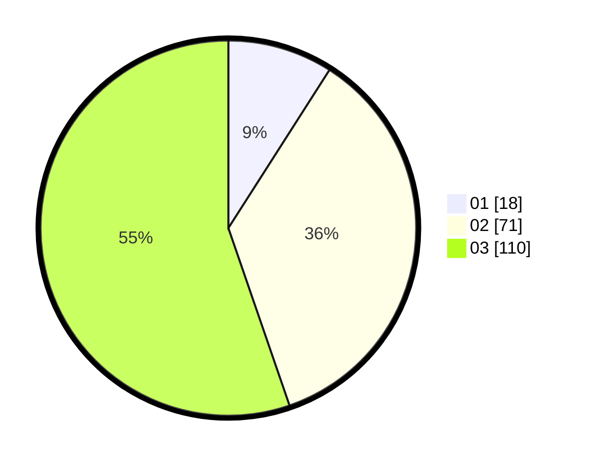

# Hasil

Hasil perolehan suara paslon dapat dilihat pada file paslon-01.txt, paslon-02.txt, dan paslon-03.txt.

Jika tidak ada, artinya data tersebut belum ada pada SIREKAP.

## Perolehan Suara

 * Paslon 01: **18**.
 * Paslon 02: **71**.
 * Paslon 03: **110**.

## Foto C Plano

https://sirekap-obj-formc.kpu.go.id/2e84/pemilu/ppwp/31/73/07/10/04/3173071004006-20240214-205902--b621a6ef-33df-4c5d-9b44-b97671faff7d.jpg

https://sirekap-obj-formc.kpu.go.id/2e84/pemilu/ppwp/31/73/07/10/04/3173071004006-20240214-210007--51f24616-f02c-4d4b-b314-02d5d755575e.jpg

https://sirekap-obj-formc.kpu.go.id/2e84/pemilu/ppwp/31/73/07/10/04/3173071004006-20240214-210058--f8f8216c-137c-4d46-9a50-b5a484849886.jpg
