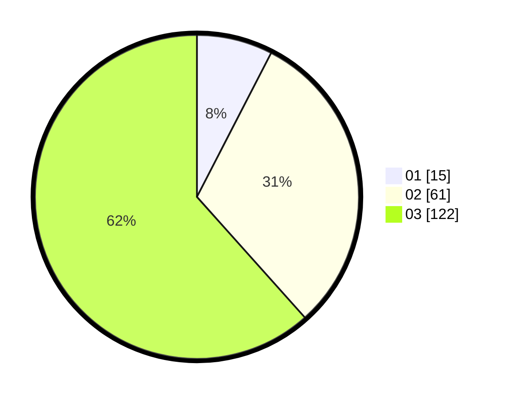

# Hasil

Hasil perolehan suara paslon dapat dilihat pada file paslon-01.txt, paslon-02.txt, dan paslon-03.txt.

Jika tidak ada, artinya data tersebut belum ada pada SIREKAP.

## Perolehan Suara

 * Paslon 01: **15**.
 * Paslon 02: **61**.
 * Paslon 03: **122**.

## Foto C Plano

https://sirekap-obj-formc.kpu.go.id/9e39/pemilu/ppwp/31/73/07/10/04/3173071004007-20240214-185825--6d2cad42-5dc1-4f19-aca7-d7e6ab55fd6a.jpg

https://sirekap-obj-formc.kpu.go.id/9e39/pemilu/ppwp/31/73/07/10/04/3173071004007-20240214-185601--3f696a1b-a1e3-4927-bd1a-f9001184df27.jpg

https://sirekap-obj-formc.kpu.go.id/9e39/pemilu/ppwp/31/73/07/10/04/3173071004007-20240214-185924--b05f65ed-7545-461b-b110-7670eb0af401.jpg
