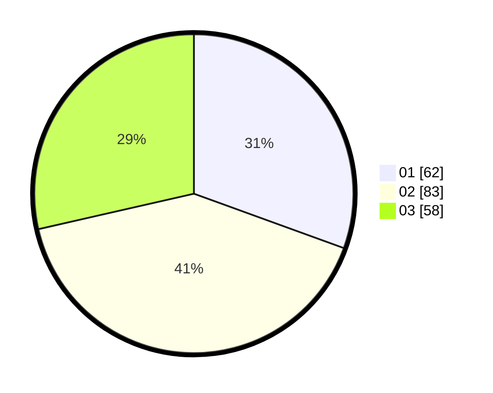

# Hasil

Hasil perolehan suara paslon dapat dilihat pada file paslon-01.txt, paslon-02.txt, dan paslon-03.txt.

Jika tidak ada, artinya data tersebut belum ada pada SIREKAP.

## Perolehan Suara

 * Paslon 01: **62**.
 * Paslon 02: **83**.
 * Paslon 03: **58**.

## Foto C Plano

https://sirekap-obj-formc.kpu.go.id/ba60/pemilu/ppwp/31/73/07/10/04/3173071004016-20240215-022844--29384942-bcd1-475e-99a9-3e9299748282.jpg

https://sirekap-obj-formc.kpu.go.id/ba60/pemilu/ppwp/31/73/07/10/04/3173071004016-20240215-022918--5f4edb75-93d3-4a69-a603-d1e954dcf700.jpg

https://sirekap-obj-formc.kpu.go.id/ba60/pemilu/ppwp/31/73/07/10/04/3173071004016-20240215-023000--b675d57e-ba21-4dd0-8f8a-c23ae8c8b4a7.jpg
