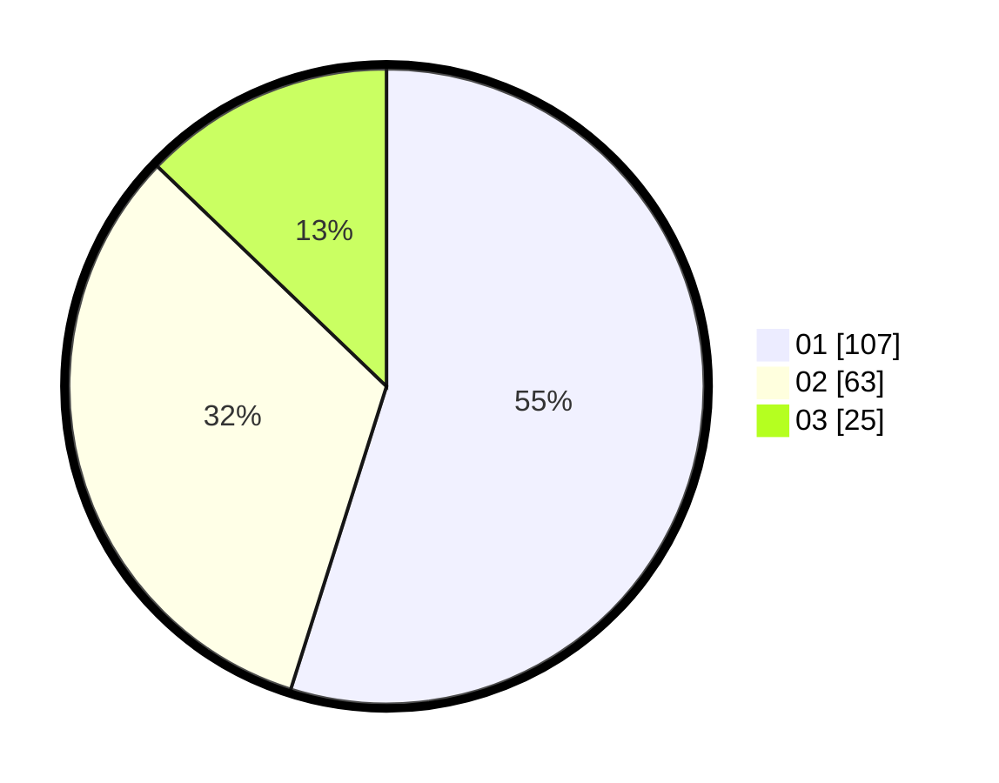

# Hasil

Hasil perolehan suara paslon dapat dilihat pada file paslon-01.txt, paslon-02.txt, dan paslon-03.txt.

Jika tidak ada, artinya data tersebut belum ada pada SIREKAP.

## Perolehan Suara

 * Paslon 01: **107**.
 * Paslon 02: **63**.
 * Paslon 03: **25**.

## Foto C Plano

https://sirekap-obj-formc.kpu.go.id/28ef/pemilu/ppwp/31/73/07/10/04/3173071004023-20240215-023727--a017fced-45fd-4a42-a394-684aa77fb27e.jpg

https://sirekap-obj-formc.kpu.go.id/28ef/pemilu/ppwp/31/73/07/10/04/3173071004023-20240215-023835--07239b73-9b15-422d-874f-c3f980872a19.jpg

https://sirekap-obj-formc.kpu.go.id/28ef/pemilu/ppwp/31/73/07/10/04/3173071004023-20240215-023955--8520fae5-520e-4d3c-8c28-4b8872803210.jpg
