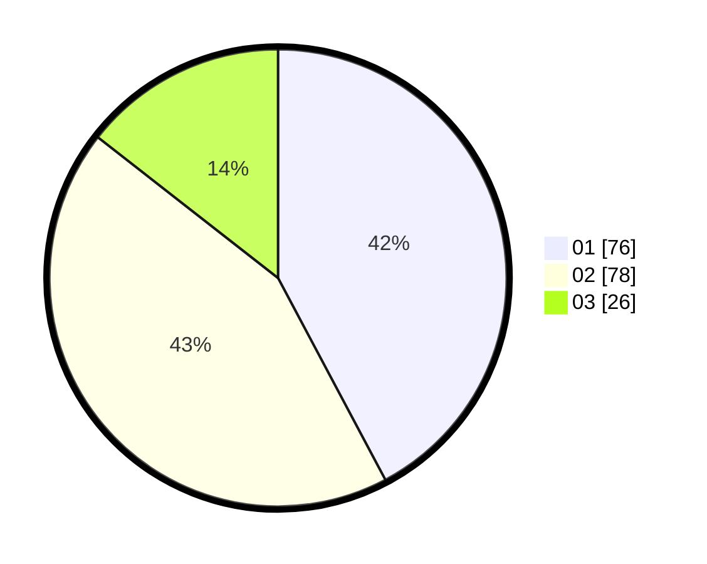

# Hasil

Hasil perolehan suara paslon dapat dilihat pada file paslon-01.txt, paslon-02.txt, dan paslon-03.txt.

Jika tidak ada, artinya data tersebut belum ada pada SIREKAP.

## Perolehan Suara

 * Paslon 01: **76**.
 * Paslon 02: **78**.
 * Paslon 03: **26**.

## Foto C Plano

https://sirekap-obj-formc.kpu.go.id/628a/pemilu/ppwp/31/73/07/10/04/3173071004032-20240214-222346--4475d918-524f-4a41-873a-2b3aa5a813ec.jpg

https://sirekap-obj-formc.kpu.go.id/628a/pemilu/ppwp/31/73/07/10/04/3173071004032-20240214-224347--03cd31d7-6ae0-4890-959d-324bec72bf1f.jpg

https://sirekap-obj-formc.kpu.go.id/628a/pemilu/ppwp/31/73/07/10/04/3173071004032-20240214-155749--8ff73e5e-b96e-42c3-b082-71bcd5ec9273.jpg
