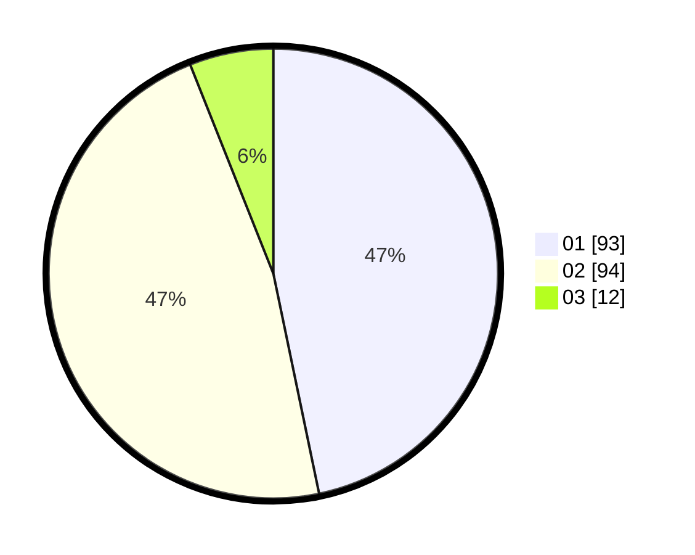

# Hasil

Hasil perolehan suara paslon dapat dilihat pada file paslon-01.txt, paslon-02.txt, dan paslon-03.txt.

Jika tidak ada, artinya data tersebut belum ada pada SIREKAP.

## Perolehan Suara

 * Paslon 01: **93**.
 * Paslon 02: **94**.
 * Paslon 03: **12**.

## Foto C Plano

https://sirekap-obj-formc.kpu.go.id/488f/pemilu/ppwp/31/73/07/10/04/3173071004036-20240216-101014--8a82aeb1-d951-48c9-a386-84fbd47d3432.jpg

https://sirekap-obj-formc.kpu.go.id/488f/pemilu/ppwp/31/73/07/10/04/3173071004036-20240216-101031--28ae83c4-0a2d-4af1-ac53-b254e3b291aa.jpg

https://sirekap-obj-formc.kpu.go.id/488f/pemilu/ppwp/31/73/07/10/04/3173071004036-20240216-121557--48db701d-423d-4ae4-87d0-ee40cf7bcfbe.jpg

## DATA PEMILIH TETAP

Jumlah pemilih dalam DPT: **259**.
 * L: **125**.
 * P: **134**.

## DATA PENGGUNA HAK PILIH

Jumlah pengguna hak pilih dalam DPT: **202**.
 * L: **97**.
 * P: **105**.

Jumlah pengguna hak pilih dalam DPTb: **0**.
 * L: **0**.
 * P: **0**.

Jumlah pengguna hak pilih dalam DPK: **0**.
 * L: **0**.
 * P: **0**.

Jumlah pengguna hak pilih: **202**.
 * L: **97**.
 * P: **105**.

## JUMLAH SUARA SAH DAN TIDAK SAH

JUMLAH SELURUH SUARA SAH: **199**.

JUMLAH SUARA TIDAK SAH: **3**.

JUMLAH SELURUH SUARA SAH DAN SUARA TIDAK SAH: **202**.
