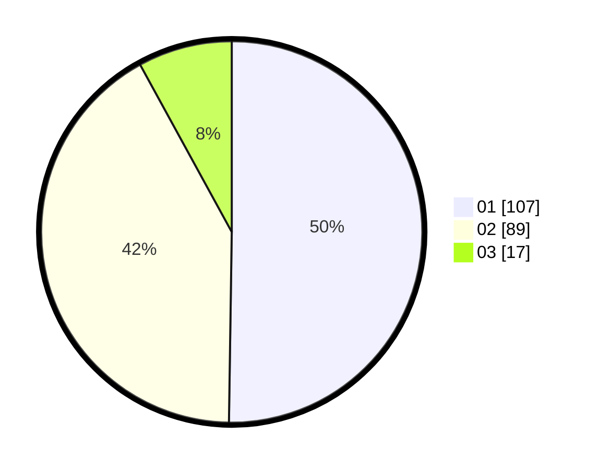

# Hasil

Hasil perolehan suara paslon dapat dilihat pada file paslon-01.txt, paslon-02.txt, dan paslon-03.txt.

Jika tidak ada, artinya data tersebut belum ada pada SIREKAP.

## Perolehan Suara

 * Paslon 01: **107**.
 * Paslon 02: **89**.
 * Paslon 03: **17**.

## Foto C Plano

https://sirekap-obj-formc.kpu.go.id/8bad/pemilu/ppwp/31/73/07/10/04/3173071004038-20240214-210516--3dfe1289-2fe1-4232-8842-e706a434a5b5.jpg

https://sirekap-obj-formc.kpu.go.id/8bad/pemilu/ppwp/31/73/07/10/04/3173071004038-20240214-210530--7e68d51b-1c63-42c0-a098-1728222b5829.jpg

https://sirekap-obj-formc.kpu.go.id/8bad/pemilu/ppwp/31/73/07/10/04/3173071004038-20240214-210550--1b960b55-7910-4e6e-99ec-438742d01d72.jpg
