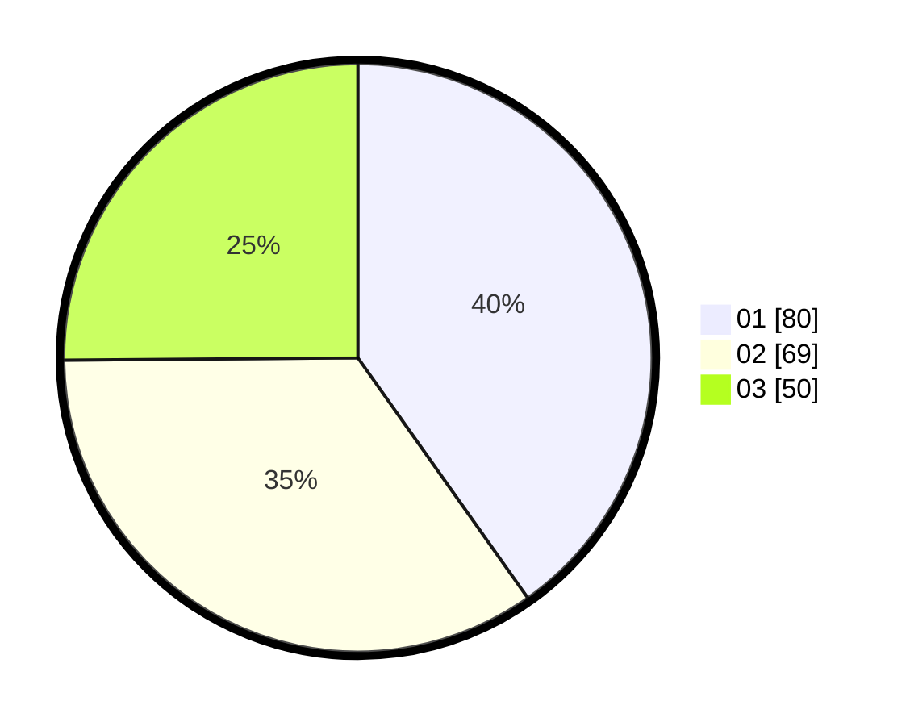

# Hasil

Hasil perolehan suara paslon dapat dilihat pada file paslon-01.txt, paslon-02.txt, dan paslon-03.txt.

Jika tidak ada, artinya data tersebut belum ada pada SIREKAP.

## Perolehan Suara

 * Paslon 01: **80**.
 * Paslon 02: **69**.
 * Paslon 03: **50**.

## Foto C Plano

https://sirekap-obj-formc.kpu.go.id/e4ff/pemilu/ppwp/31/73/07/10/04/3173071004045-20240214-162228--f704ab6b-ae37-434b-8fb4-057864ef7b1c.jpg

https://sirekap-obj-formc.kpu.go.id/e4ff/pemilu/ppwp/31/73/07/10/04/3173071004045-20240214-231321--4f522efe-7b84-4994-aaa5-85714486ffc2.jpg

https://sirekap-obj-formc.kpu.go.id/e4ff/pemilu/ppwp/31/73/07/10/04/3173071004045-20240214-162236--b65cc097-ffc7-426e-a114-cf4d9e6aec31.jpg

## DATA PEMILIH TETAP

Jumlah pemilih dalam DPT: **246**.
 * L: **128**.
 * P: **118**.

## DATA PENGGUNA HAK PILIH

Jumlah pengguna hak pilih dalam DPT: **199**.
 * L: **103**.
 * P: **96**.

Jumlah pengguna hak pilih dalam DPTb: **1**.
 * L: **1**.
 * P: **0**.

Jumlah pengguna hak pilih dalam DPK: **1**.
 * L: **0**.
 * P: **1**.

Jumlah pengguna hak pilih: **201**.
 * L: **104**.
 * P: **97**.

## JUMLAH SUARA SAH DAN TIDAK SAH

JUMLAH SELURUH SUARA SAH: **199**.

JUMLAH SUARA TIDAK SAH: **2**.

JUMLAH SELURUH SUARA SAH DAN SUARA TIDAK SAH: **201**.
