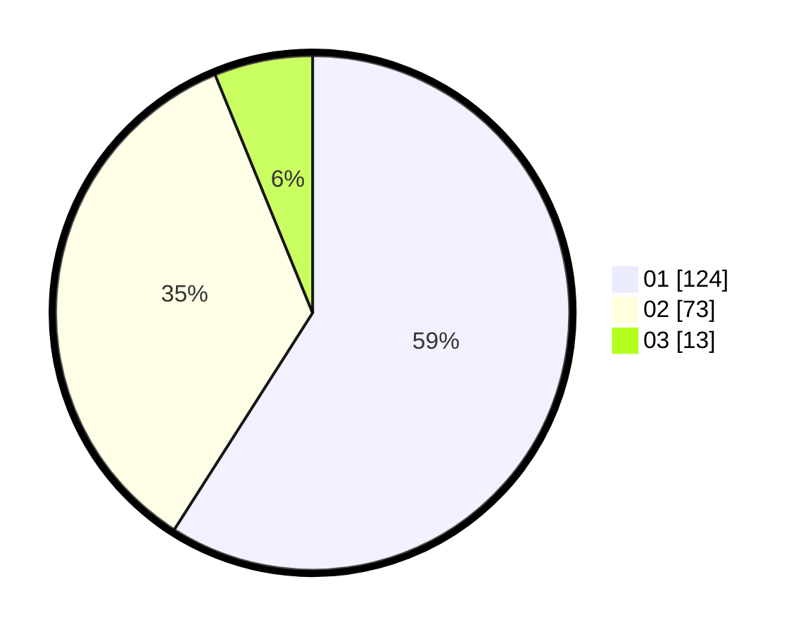

# Hasil

Hasil perolehan suara paslon dapat dilihat pada file paslon-01.txt, paslon-02.txt, dan paslon-03.txt.

Jika tidak ada, artinya data tersebut belum ada pada SIREKAP.

## Perolehan Suara

 * Paslon 01: **124**.
 * Paslon 02: **73**.
 * Paslon 03: **13**.

## Foto C Plano

https://sirekap-obj-formc.kpu.go.id/e45d/pemilu/ppwp/31/73/07/10/04/3173071004047-20240215-010216--730d59ca-3115-4ba0-a3ae-ca118558663b.jpg

https://sirekap-obj-formc.kpu.go.id/e45d/pemilu/ppwp/31/73/07/10/04/3173071004047-20240215-003145--083ab9fc-be09-454b-b7d8-0e5b2194a47a.jpg

https://sirekap-obj-formc.kpu.go.id/e45d/pemilu/ppwp/31/73/07/10/04/3173071004047-20240215-003507--71bc0fdf-c19c-445d-9010-570db66f9974.jpg
