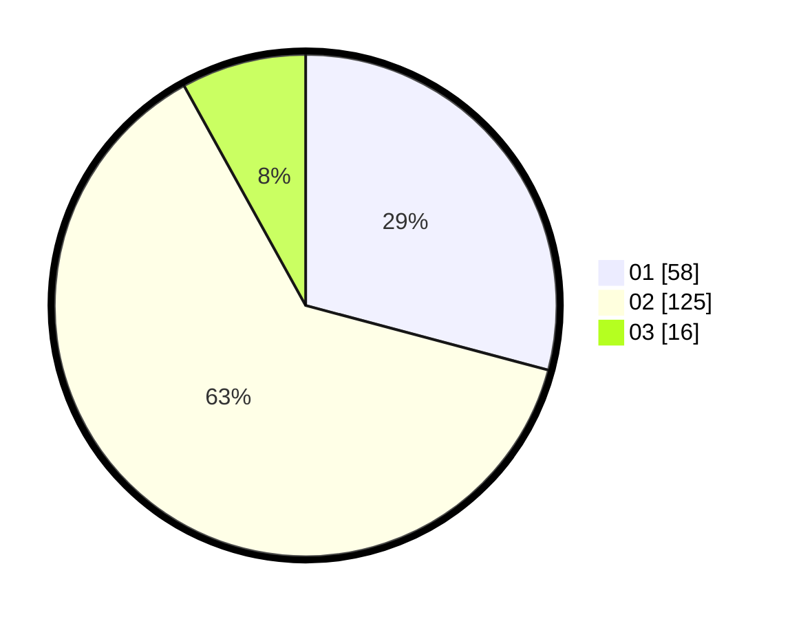

# Hasil

Hasil perolehan suara paslon dapat dilihat pada file paslon-01.txt, paslon-02.txt, dan paslon-03.txt.

Jika tidak ada, artinya data tersebut belum ada pada SIREKAP.

## Perolehan Suara

 * Paslon 01: **58**.
 * Paslon 02: **125**.
 * Paslon 03: **16**.

## Foto C Plano

https://sirekap-obj-formc.kpu.go.id/f655/pemilu/ppwp/31/73/07/10/04/3173071004055-20240214-191158--9f59cf14-600d-445b-8181-ac39110874e5.jpg

https://sirekap-obj-formc.kpu.go.id/f655/pemilu/ppwp/31/73/07/10/04/3173071004055-20240214-190854--037f3272-0e80-4efd-85a9-2aa98414f144.jpg
