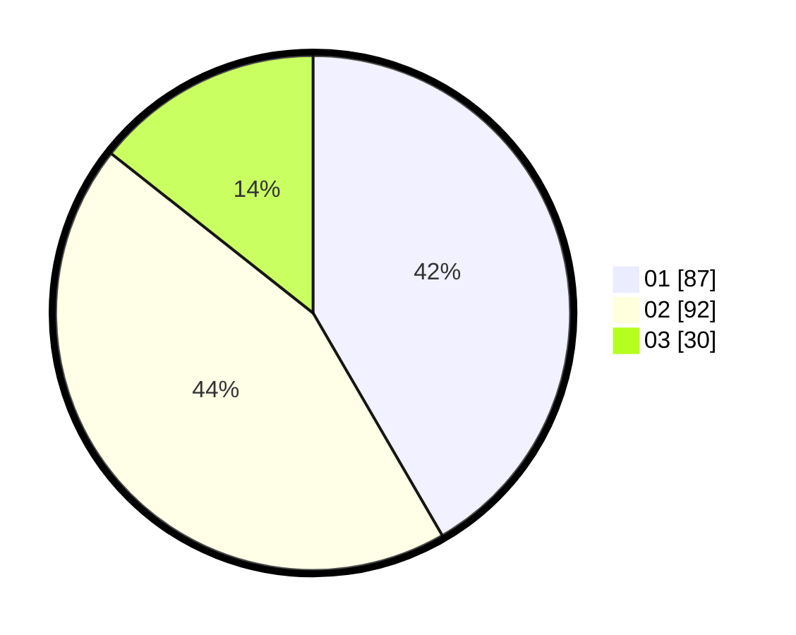

# Hasil

Hasil perolehan suara paslon dapat dilihat pada file paslon-01.txt, paslon-02.txt, dan paslon-03.txt.

Jika tidak ada, artinya data tersebut belum ada pada SIREKAP.

## Perolehan Suara

 * Paslon 01: **87**.
 * Paslon 02: **92**.
 * Paslon 03: **30**.

## Foto C Plano

https://sirekap-obj-formc.kpu.go.id/7dc4/pemilu/ppwp/31/73/07/10/04/3173071004063-20240214-155914--8f293197-0984-41c5-95d4-f29d69d7a4fa.jpg

https://sirekap-obj-formc.kpu.go.id/7dc4/pemilu/ppwp/31/73/07/10/04/3173071004063-20240215-223809--30d1c9ba-fbd1-4a06-8262-067fe8dcda5e.jpg
