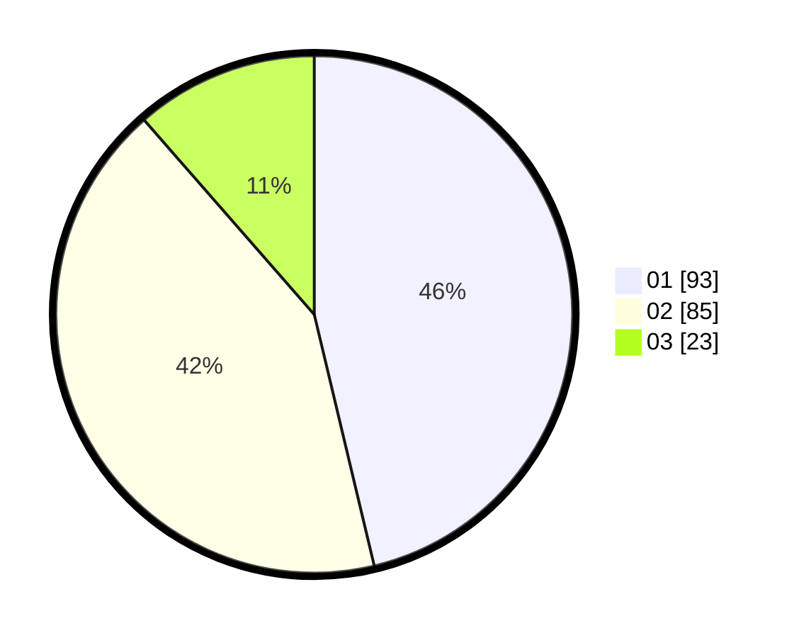

# Hasil

Hasil perolehan suara paslon dapat dilihat pada file paslon-01.txt, paslon-02.txt, dan paslon-03.txt.

Jika tidak ada, artinya data tersebut belum ada pada SIREKAP.

## Perolehan Suara

 * Paslon 01: **93**.
 * Paslon 02: **85**.
 * Paslon 03: **23**.

## Foto C Plano

https://sirekap-obj-formc.kpu.go.id/30c6/pemilu/ppwp/31/73/07/10/04/3173071004065-20240216-134857--6113aeb1-e682-4329-8ad8-d2df64b7f4a9.jpg

https://sirekap-obj-formc.kpu.go.id/30c6/pemilu/ppwp/31/73/07/10/04/3173071004065-20240214-203217--85cb00ec-6a3b-4aee-bce7-45078b2ebbc5.jpg

https://sirekap-obj-formc.kpu.go.id/30c6/pemilu/ppwp/31/73/07/10/04/3173071004065-20240214-224646--9cf1eeec-d23c-4c42-9b48-bb42d69b6f42.jpg

## DATA PEMILIH TETAP

Jumlah pemilih dalam DPT: **257**.
 * L: **122**.
 * P: **135**.

## DATA PENGGUNA HAK PILIH

Jumlah pengguna hak pilih dalam DPT: **200**.
 * L: **94**.
 * P: **106**.

Jumlah pengguna hak pilih dalam DPTb: **0**.
 * L: **0**.
 * P: **0**.

Jumlah pengguna hak pilih dalam DPK: **3**.
 * L: **2**.
 * P: **1**.

Jumlah pengguna hak pilih: **203**.
 * L: **96**.
 * P: **107**.

## JUMLAH SUARA SAH DAN TIDAK SAH

JUMLAH SELURUH SUARA SAH: **201**.

JUMLAH SUARA TIDAK SAH: **2**.

JUMLAH SELURUH SUARA SAH DAN SUARA TIDAK SAH: **203**.
