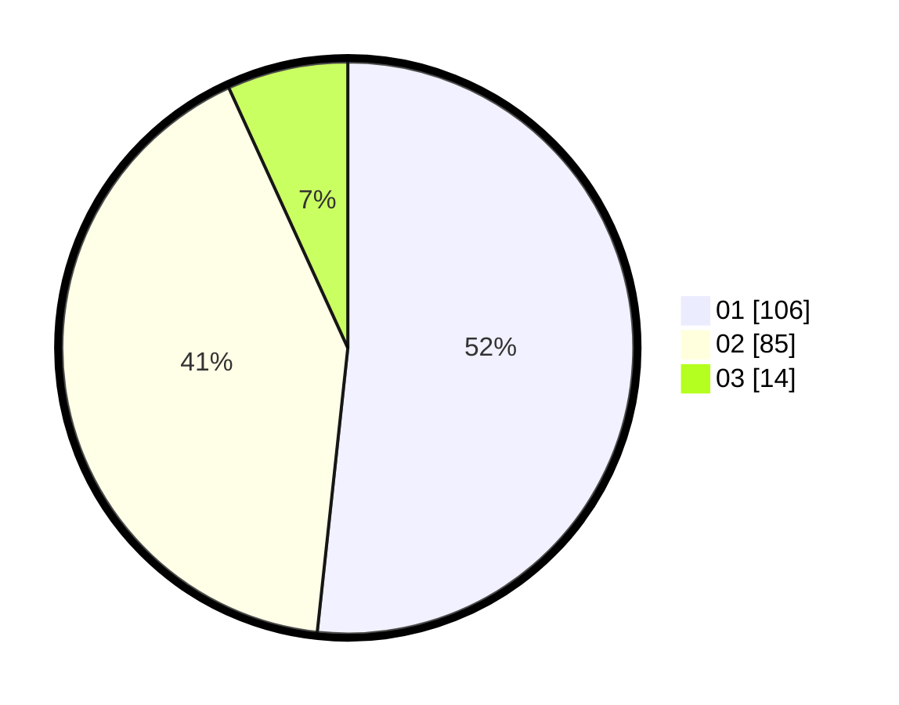

# Hasil

Hasil perolehan suara paslon dapat dilihat pada file paslon-01.txt, paslon-02.txt, dan paslon-03.txt.

Jika tidak ada, artinya data tersebut belum ada pada SIREKAP.

## Perolehan Suara

 * Paslon 01: **106**.
 * Paslon 02: **85**.
 * Paslon 03: **14**.

## Foto C Plano

https://sirekap-obj-formc.kpu.go.id/c06e/pemilu/ppwp/31/73/07/10/04/3173071004069-20240214-191837--2ac85d10-8c98-42ae-aacc-00e0bedaef78.jpg

https://sirekap-obj-formc.kpu.go.id/c06e/pemilu/ppwp/31/73/07/10/04/3173071004069-20240214-191810--d5c98711-01ad-40ba-8ee6-e436e53864be.jpg
