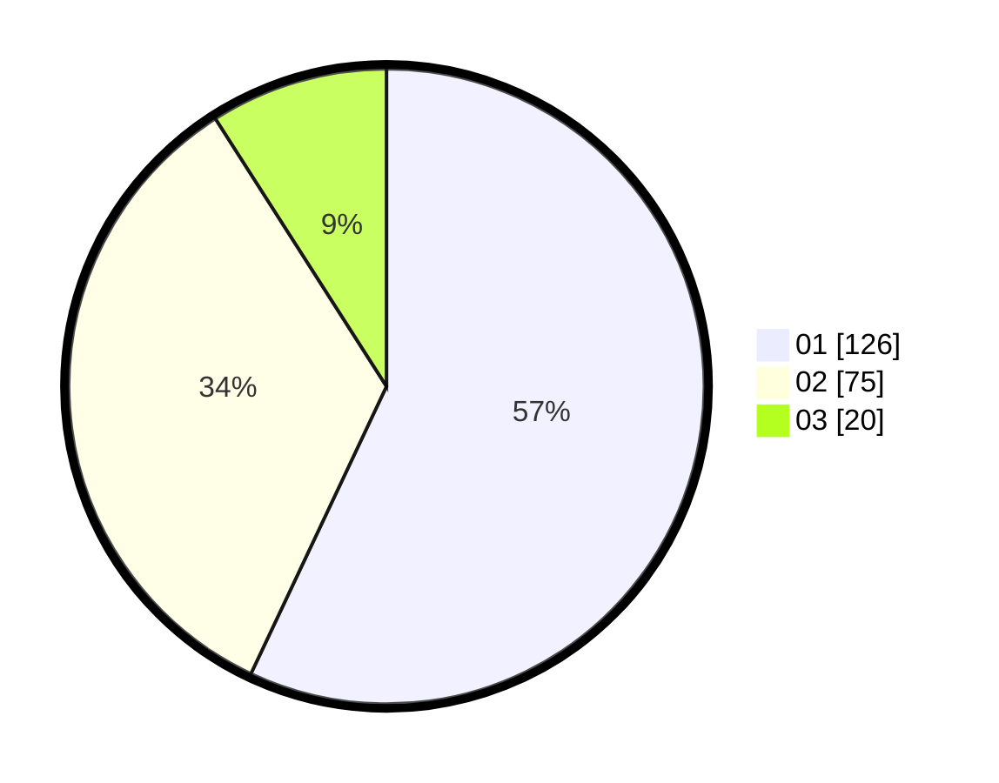

# Hasil

Hasil perolehan suara paslon dapat dilihat pada file paslon-01.txt, paslon-02.txt, dan paslon-03.txt.

Jika tidak ada, artinya data tersebut belum ada pada SIREKAP.

## Perolehan Suara

 * Paslon 01: **126**.
 * Paslon 02: **75**.
 * Paslon 03: **20**.

## Foto C Plano

https://sirekap-obj-formc.kpu.go.id/fdbd/pemilu/ppwp/31/73/07/10/04/3173071004070-20240214-210434--c56c2789-7be3-496f-9361-5d43eac7b296.jpg

https://sirekap-obj-formc.kpu.go.id/fdbd/pemilu/ppwp/31/73/07/10/04/3173071004070-20240214-210606--519b00d1-dd57-4deb-bc8a-702c32335400.jpg

https://sirekap-obj-formc.kpu.go.id/fdbd/pemilu/ppwp/31/73/07/10/04/3173071004070-20240214-220812--3704d55e-c11f-4f51-954c-5ab386d86c58.jpg

## DATA PEMILIH TETAP

Jumlah pemilih dalam DPT: **278**.
 * L: **137**.
 * P: **141**.

## DATA PENGGUNA HAK PILIH

Jumlah pengguna hak pilih dalam DPT: **221**.
 * L: **107**.
 * P: **114**.

Jumlah pengguna hak pilih dalam DPTb: **222**.
 * L: **3**.
 * P: **0**.

Jumlah pengguna hak pilih dalam DPK: **2**.
 * L: **1**.
 * P: **1**.

Jumlah pengguna hak pilih: **226**.
 * L: **111**.
 * P: **115**.

## JUMLAH SUARA SAH DAN TIDAK SAH

JUMLAH SELURUH SUARA SAH: **221**.

JUMLAH SUARA TIDAK SAH: **5**.

JUMLAH SELURUH SUARA SAH DAN SUARA TIDAK SAH: **226**.
