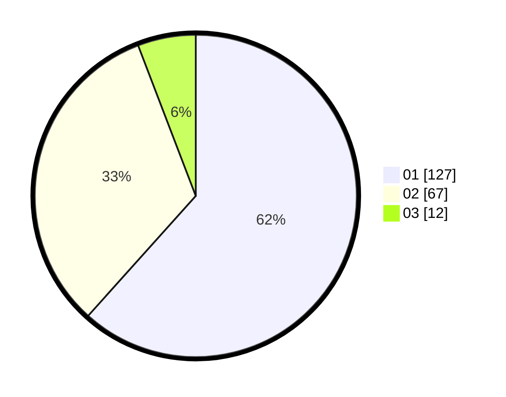

# Hasil

Hasil perolehan suara paslon dapat dilihat pada file paslon-01.txt, paslon-02.txt, dan paslon-03.txt.

Jika tidak ada, artinya data tersebut belum ada pada SIREKAP.

## Perolehan Suara

 * Paslon 01: **127**.
 * Paslon 02: **67**.
 * Paslon 03: **12**.

## Foto C Plano

https://sirekap-obj-formc.kpu.go.id/7cee/pemilu/ppwp/31/73/07/10/04/3173071004072-20240214-231400--a1880b62-cca0-40ca-aed9-8ce4820ff7ef.jpg

https://sirekap-obj-formc.kpu.go.id/7cee/pemilu/ppwp/31/73/07/10/04/3173071004072-20240214-231517--0327d0c7-de51-4603-9995-2ea8bbe98d22.jpg

https://sirekap-obj-formc.kpu.go.id/7cee/pemilu/ppwp/31/73/07/10/04/3173071004072-20240214-231812--39af7df1-ede4-4666-a836-c72450235f66.jpg
