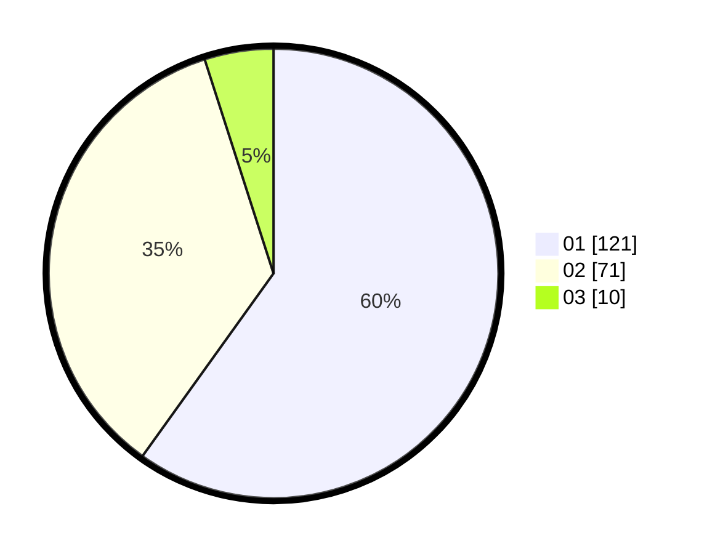

# Hasil

Hasil perolehan suara paslon dapat dilihat pada file paslon-01.txt, paslon-02.txt, dan paslon-03.txt.

Jika tidak ada, artinya data tersebut belum ada pada SIREKAP.

## Perolehan Suara

 * Paslon 01: **121**.
 * Paslon 02: **71**.
 * Paslon 03: **10**.

## Foto C Plano

https://sirekap-obj-formc.kpu.go.id/a430/pemilu/ppwp/31/73/07/10/04/3173071004073-20240215-022225--ac532dc7-f70b-4f3a-a020-afc4b7ddd765.jpg

https://sirekap-obj-formc.kpu.go.id/a430/pemilu/ppwp/31/73/07/10/04/3173071004073-20240215-022345--1de1105d-314e-4daf-85bf-83802b6e72ad.jpg

https://sirekap-obj-formc.kpu.go.id/a430/pemilu/ppwp/31/73/07/10/04/3173071004073-20240215-022425--144a9a8d-51be-414c-b1d9-a332ee1dac28.jpg

## DATA PEMILIH TETAP

Jumlah pemilih dalam DPT: **283**.
 * L: **136**.
 * P: **147**.

## DATA PENGGUNA HAK PILIH

Jumlah pengguna hak pilih dalam DPT: **192**.
 * L: **93**.
 * P: **99**.

Jumlah pengguna hak pilih dalam DPTb: **5**.
 * L: **2**.
 * P: **3**.

Jumlah pengguna hak pilih dalam DPK: **7**.
 * L: **4**.
 * P: **3**.

Jumlah pengguna hak pilih: **204**.
 * L: **99**.
 * P: **105**.

## JUMLAH SUARA SAH DAN TIDAK SAH

JUMLAH SELURUH SUARA SAH: **202**.

JUMLAH SUARA TIDAK SAH: **2**.

JUMLAH SELURUH SUARA SAH DAN SUARA TIDAK SAH: **204**.
