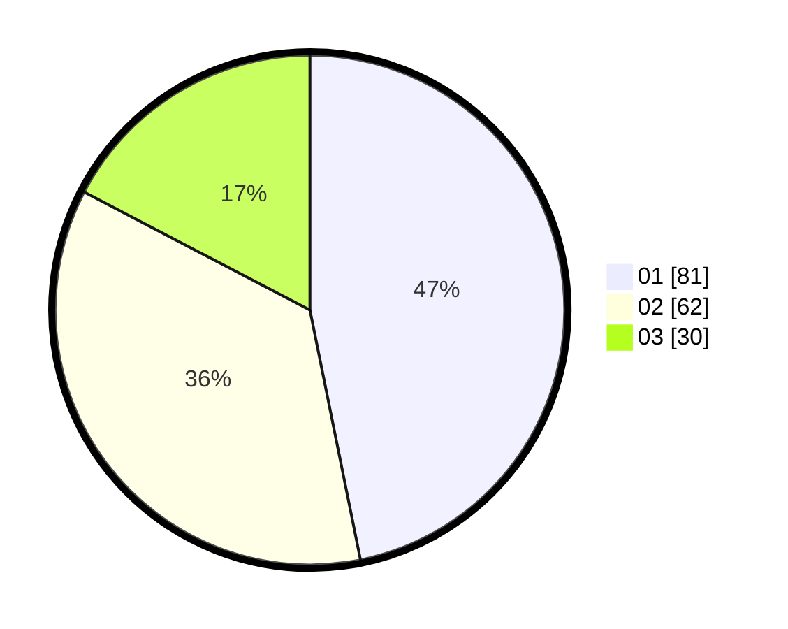

# Hasil

Hasil perolehan suara paslon dapat dilihat pada file paslon-01.txt, paslon-02.txt, dan paslon-03.txt.

Jika tidak ada, artinya data tersebut belum ada pada SIREKAP.

## Perolehan Suara

 * Paslon 01: **81**.
 * Paslon 02: **62**.
 * Paslon 03: **30**.

## Foto C Plano

https://sirekap-obj-formc.kpu.go.id/f5f0/pemilu/ppwp/31/73/07/10/04/3173071004074-20240214-224325--4d7b00e8-61ea-4314-84ea-a7cdf581f66c.jpg

https://sirekap-obj-formc.kpu.go.id/f5f0/pemilu/ppwp/31/73/07/10/04/3173071004074-20240214-224453--155dfb81-a187-419e-9c04-f12625d04520.jpg

https://sirekap-obj-formc.kpu.go.id/f5f0/pemilu/ppwp/31/73/07/10/04/3173071004074-20240214-224512--2921b999-bcc2-48ab-bb98-4316d7b31234.jpg

## DATA PEMILIH TETAP

Jumlah pemilih dalam DPT: **231**.
 * L: **120**.
 * P: **111**.

## DATA PENGGUNA HAK PILIH

Jumlah pengguna hak pilih dalam DPT: **177**.
 * L: **92**.
 * P: **85**.

Jumlah pengguna hak pilih dalam DPTb: **0**.
 * L: **0**.
 * P: **0**.

Jumlah pengguna hak pilih dalam DPK: **0**.
 * L: **0**.
 * P: **0**.

Jumlah pengguna hak pilih: **177**.
 * L: **92**.
 * P: **85**.

## JUMLAH SUARA SAH DAN TIDAK SAH

JUMLAH SELURUH SUARA SAH: **173**.

JUMLAH SUARA TIDAK SAH: **4**.

JUMLAH SELURUH SUARA SAH DAN SUARA TIDAK SAH: **177**.
