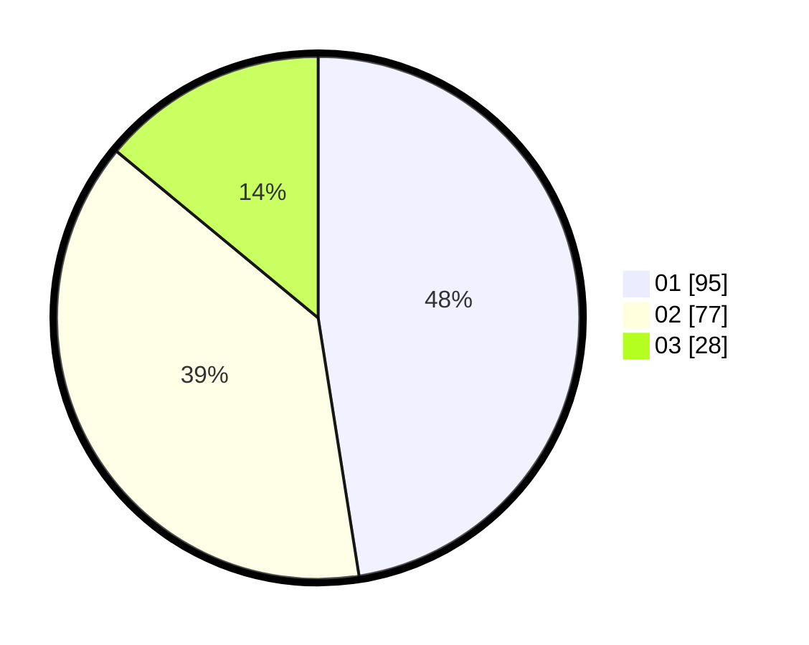

# Hasil

Hasil perolehan suara paslon dapat dilihat pada file paslon-01.txt, paslon-02.txt, dan paslon-03.txt.

Jika tidak ada, artinya data tersebut belum ada pada SIREKAP.

## Perolehan Suara

 * Paslon 01: **95**.
 * Paslon 02: **77**.
 * Paslon 03: **28**.

## Foto C Plano

https://sirekap-obj-formc.kpu.go.id/dc0a/pemilu/ppwp/31/73/07/10/04/3173071004080-20240214-155523--cafc5201-4cc3-4d0e-ba7c-7b7c7785e949.jpg

https://sirekap-obj-formc.kpu.go.id/dc0a/pemilu/ppwp/31/73/07/10/04/3173071004080-20240214-155144--4980d7fe-daf9-4ec8-9e87-9dd178c9f7bb.jpg

https://sirekap-obj-formc.kpu.go.id/dc0a/pemilu/ppwp/31/73/07/10/04/3173071004080-20240214-155239--7c12134e-c4f5-4a4c-a992-4d05a74a05e1.jpg

## DATA PEMILIH TETAP

Jumlah pemilih dalam DPT: **280**.
 * L: **143**.
 * P: **137**.

## DATA PENGGUNA HAK PILIH

Jumlah pengguna hak pilih dalam DPT: **198**.
 * L: **95**.
 * P: **103**.

Jumlah pengguna hak pilih dalam DPTb: **1**.
 * L: **0**.
 * P: **1**.

Jumlah pengguna hak pilih dalam DPK: **2**.
 * L: **1**.
 * P: **1**.

Jumlah pengguna hak pilih: **201**.
 * L: **96**.
 * P: **105**.

## JUMLAH SUARA SAH DAN TIDAK SAH

JUMLAH SELURUH SUARA SAH: **200**.

JUMLAH SUARA TIDAK SAH: **1**.

JUMLAH SELURUH SUARA SAH DAN SUARA TIDAK SAH: **201**.
