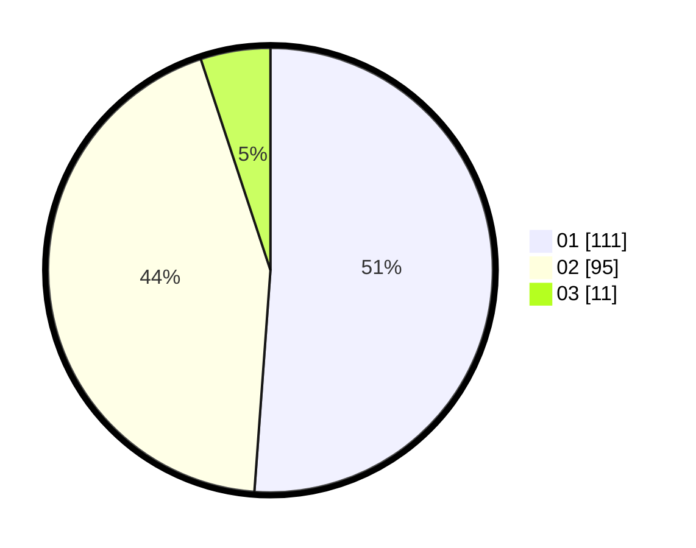

# Hasil

Hasil perolehan suara paslon dapat dilihat pada file paslon-01.txt, paslon-02.txt, dan paslon-03.txt.

Jika tidak ada, artinya data tersebut belum ada pada SIREKAP.

## Perolehan Suara

 * Paslon 01: **111**.
 * Paslon 02: **95**.
 * Paslon 03: **11**.

## Foto C Plano

https://sirekap-obj-formc.kpu.go.id/c721/pemilu/ppwp/31/73/07/10/04/3173071004082-20240215-025735--e56e38ec-e1fc-40ae-98cc-6516c6ca6c02.jpg

https://sirekap-obj-formc.kpu.go.id/c721/pemilu/ppwp/31/73/07/10/04/3173071004082-20240215-025810--513dcd6d-17c6-4949-8221-28304e463ab8.jpg

https://sirekap-obj-formc.kpu.go.id/c721/pemilu/ppwp/31/73/07/10/04/3173071004082-20240215-025857--75875c07-bbae-499b-a526-fcd46797fb82.jpg
