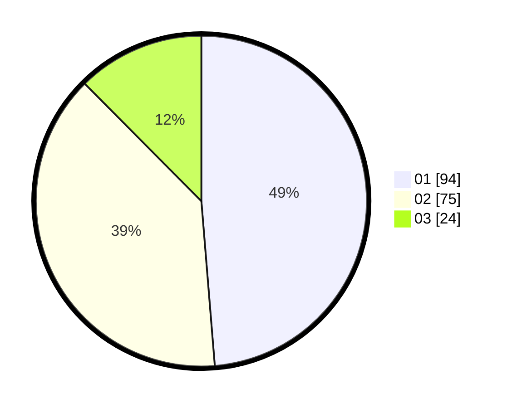

# Hasil

Hasil perolehan suara paslon dapat dilihat pada file paslon-01.txt, paslon-02.txt, dan paslon-03.txt.

Jika tidak ada, artinya data tersebut belum ada pada SIREKAP.

## Perolehan Suara

 * Paslon 01: **94**.
 * Paslon 02: **75**.
 * Paslon 03: **24**.

## Foto C Plano

https://sirekap-obj-formc.kpu.go.id/8235/pemilu/ppwp/31/73/07/10/04/3173071004083-20240214-195707--a612100d-87e2-4ba8-b36a-b0e11a94532c.jpg

https://sirekap-obj-formc.kpu.go.id/8235/pemilu/ppwp/31/73/07/10/04/3173071004083-20240214-195703--b6fd6b20-11c5-4c3e-b129-ec760a6a8a07.jpg

https://sirekap-obj-formc.kpu.go.id/8235/pemilu/ppwp/31/73/07/10/04/3173071004083-20240214-212502--fda597e0-766a-44b2-ac64-de57be9f71a4.jpg
