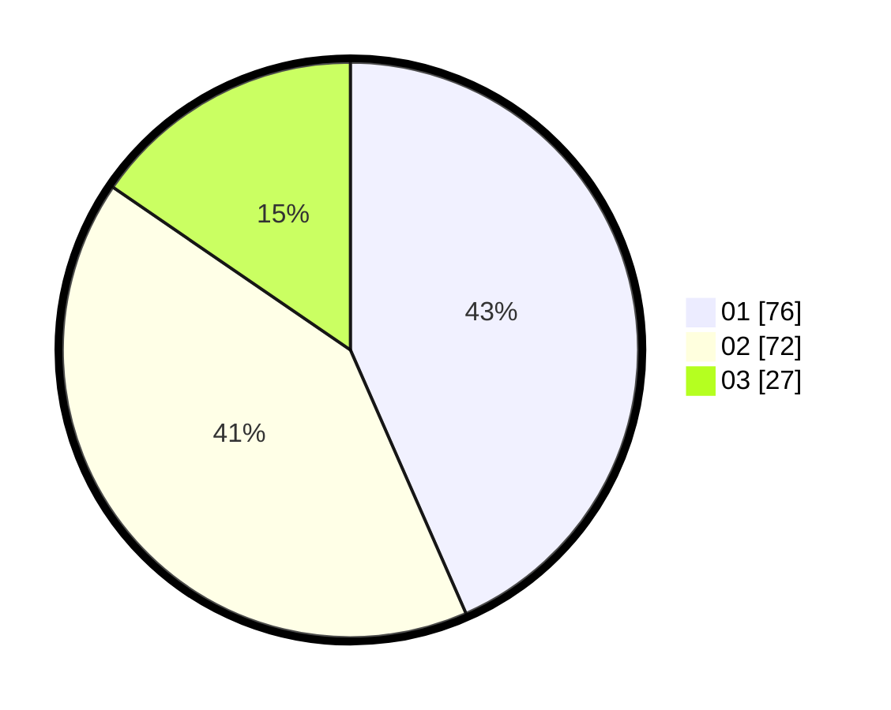

# Hasil

Hasil perolehan suara paslon dapat dilihat pada file paslon-01.txt, paslon-02.txt, dan paslon-03.txt.

Jika tidak ada, artinya data tersebut belum ada pada SIREKAP.

## Perolehan Suara

 * Paslon 01: **76**.
 * Paslon 02: **72**.
 * Paslon 03: **27**.

## Foto C Plano

https://sirekap-obj-formc.kpu.go.id/d203/pemilu/ppwp/31/73/07/10/04/3173071004088-20240215-024949--8e21a924-1107-4942-98d2-6b7f19c27247.jpg

https://sirekap-obj-formc.kpu.go.id/d203/pemilu/ppwp/31/73/07/10/04/3173071004088-20240215-025019--e92ad606-eb67-4d44-b931-cae598f25428.jpg

https://sirekap-obj-formc.kpu.go.id/d203/pemilu/ppwp/31/73/07/10/04/3173071004088-20240215-025153--0625d8a0-02d3-4ec2-8d2d-97de5131c633.jpg
